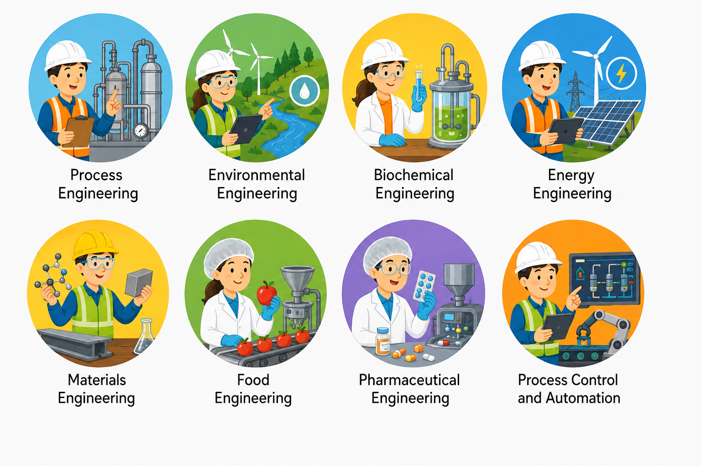

# 🧪 Lesson 1: Introduction to Chemical Engineering

## 🎯 Learning Objectives

By the end of this lesson, you will be able to:

- Understand what chemical engineering is.
- Identify the main fields of chemical engineering.
- Explain the importance of English in chemical engineering.
- Learn and use essential technical vocabulary.
- Apply new vocabulary in engineering-related contexts.

---

# 📘 Main Content

## What is Chemical Engineering? 🏭

Chemical engineering is a branch of engineering that applies principles from chemistry, physics, mathematics, biology, and economics to design, develop, improve, and operate processes that convert raw materials into useful products.

Chemical engineers work with materials and chemical reactions to produce products safely, efficiently, and sustainably. They help manufacture fuels, medicines, plastics, food, cosmetics, fertilizers, batteries, electronic materials, and many other products used every day.

Unlike chemists, who usually study substances and reactions at the laboratory scale, chemical engineers focus on transforming laboratory discoveries into large-scale industrial production. Their work involves designing equipment, optimizing manufacturing processes, reducing costs, improving product quality, and protecting both workers and the environment.

Modern chemical engineering also includes renewable energy, biotechnology, nanotechnology, environmental protection, artificial intelligence for process control, and sustainable manufacturing.

💡 **Inferred explanation:** Chemical engineering combines science with engineering design to solve real industrial problems.

---

# 🌎 Fields of Chemical Engineering

Chemical engineering offers many career opportunities across different industries. Some of the most important fields include:

## ⚗️ Process Engineering

Process engineers design and improve industrial processes that convert raw materials into valuable products.

Their responsibilities include:

- Designing production systems
- Improving efficiency
- Reducing production costs
- Increasing product quality
- Optimizing energy consumption

Example industries:

- Oil and gas
- Chemical manufacturing
- Food processing
- Pharmaceuticals

---

## 🌱 Environmental Engineering

Environmental chemical engineers develop technologies that reduce pollution and minimize environmental impact.

Typical activities include:

- Wastewater treatment
- Air pollution control
- Waste management
- Recycling technologies
- Carbon capture systems

Sustainability has become one of the most important goals in modern engineering.

🌍 Engineers constantly seek cleaner and greener production methods.

---

## 💊 Biochemical Engineering

Biochemical engineers combine biology with chemical engineering.

They work with microorganisms, enzymes, and living cells to manufacture products such as:

- Vaccines
- Antibiotics
- Insulin
- Biofuels
- Fermented foods

Biotechnology is one of the fastest-growing areas of chemical engineering.

---

## ⚡ Energy Engineering

Energy engineers develop processes that produce, store, and use energy efficiently.

Examples include:

- Hydrogen production
- Battery technology
- Fuel cells
- Solar energy
- Bioenergy
- Carbon-neutral fuels

As global energy demand increases, engineers are developing cleaner and more sustainable energy systems.

---

## 🏗️ Materials Engineering

Chemical engineers develop advanced materials with improved properties.

Examples include:

- Polymers
- Plastics
- Ceramics
- Composite materials
- Electronic materials
- Nanomaterials

These materials are used in aerospace, electronics, medicine, automotive manufacturing, and construction.

---

## 🍎 Food Engineering

Food engineers design processes that improve food production while maintaining quality and safety.

Examples include:

- Pasteurization
- Food preservation
- Packaging
- Quality control
- Process automation

Their work helps ensure that food remains safe during transportation and storage.

---

## 💉 Pharmaceutical Engineering

Pharmaceutical engineers design manufacturing systems for medicines.

Their responsibilities include:

- Drug production
- Sterile processing
- Process validation
- Quality assurance
- Regulatory compliance

Patient safety is always the highest priority.

---

## 🤖 Process Control and Automation

Modern chemical plants use advanced computer systems.

Chemical engineers work with:

- Sensors
- Controllers
- Programmable Logic Controllers (PLCs)
- Distributed Control Systems (DCS)
- Artificial Intelligence
- Data analysis

Automation improves:

- Safety
- Productivity
- Product consistency
- Energy efficiency

Industry 4.0 is transforming chemical manufacturing through smart factories and digital technologies.

---

# 🌍 Role of English in Chemical Engineering

English is the international language of science and engineering.

Most technical information is published in English, making it an essential skill for chemical engineers worldwide.

## 📚 Reading Technical Literature

Engineers regularly read:

- Research papers
- Technical manuals
- Equipment specifications
- Safety procedures
- International standards
- Engineering textbooks

Being able to understand technical English allows engineers to stay current with new technologies and research.

---

## 🤝 International Communication

Many engineering companies operate globally.

Chemical engineers often communicate with:

- International suppliers
- Customers
- Researchers
- Consultants
- Equipment manufacturers
- Government agencies

Meetings, emails, technical reports, and presentations are frequently conducted in English.

Good communication helps avoid misunderstandings and improves project success.

---

## 🧪 Research and Innovation

Most scientific journals publish articles in English.

Engineers who can read and write English have better access to:

- New discoveries
- Engineering innovations
- International conferences
- Research collaborations

Publishing research in English also increases global visibility.

---

## 💼 Career Opportunities

Many multinational companies require English proficiency.

Examples include industries such as:

- Petrochemicals
- Pharmaceuticals
- Food manufacturing
- Renewable energy
- Biotechnology

Engineers with strong English skills often have more opportunities for:

- International projects
- Higher salaries
- Leadership positions
- Graduate studies abroad

---

## ⚠️ Safety and Regulations

Safety documentation is commonly written in English.

Examples include:

- Material Safety Data Sheets (MSDS)
- Safety manuals
- Equipment instructions
- Emergency procedures
- Operating manuals

Understanding these documents helps prevent accidents and ensures regulatory compliance.

---

# 📖 Key Vocabulary

| Term | Definition |
|-------|------------|
| Chemical Engineering | Engineering discipline that transforms raw materials into useful products. |
| Process | A sequence of operations that produces a product. |
| Raw Material | Basic material used for manufacturing. |
| Sustainability | Meeting current needs while protecting future resources. |
| Automation | Using machines and computers to control processes. |
| Biotechnology | Technology based on living organisms. |
| Pollution | Harmful substances released into the environment. |
| Renewable Energy | Energy from naturally replenished sources. |
| Efficiency | Producing maximum output with minimum waste. |
| Manufacturing | Large-scale production of goods. |
| Process Control | Monitoring and regulating industrial operations. |
| Quality Assurance | Activities ensuring products meet standards. |
| Compliance | Following laws and regulations. |
| Innovation | Development of new ideas or technologies. |
| Research | Systematic investigation to gain knowledge. |

---

# ✏️ Exercise 1 — Match the Vocabulary 🧩

Match each term with its correct definition.

| Term | Definition |
|------|------------|
| 1. Automation | A. Basic material for production |
| 2. Raw Material | B. Using computers to control processes |
| 3. Sustainability | C. Following regulations |
| 4. Compliance | D. Protecting resources for the future |
| 5. Research | E. Scientific investigation |

Show answers

1 → B

2 → A

3 → D

4 → C

5 → E

---

# ✏️ Exercise 2 — Fill in the Blanks 📝

Choose the correct word.

**Word Bank**

- efficiency
- biotechnology
- manufacturing
- automation
- pollution
- process

1. Chemical engineers improve production __________.

2. __________ uses living organisms to produce valuable products.

3. Modern factories use __________ to increase productivity.

4. Engineers work to reduce environmental __________.

5. Every industrial __________ consists of several operations.

Show answers

1. efficiency

2. biotechnology

3. automation

4. pollution

5. process

---

# ✏️ Exercise 3 — Vocabulary in Context 🚀

Answer the following questions using complete sentences.

1. Why is English important for chemical engineers?

2. Name three fields of chemical engineering.

3. How does automation improve manufacturing?

4. What is sustainability in engineering?

5. What documents must engineers understand to ensure safety?

Show answers

1. English is important because engineers read research papers, communicate internationally, and prepare technical documents in English.

2. Possible answers include process engineering, environmental engineering, biochemical engineering, energy engineering, materials engineering, food engineering, pharmaceutical engineering, and process control.

3. Automation improves manufacturing by increasing productivity, improving product quality, reducing human error, and enhancing safety.

4. Sustainability means designing processes that meet current needs while minimizing environmental impact and conserving resources for future generations.

5. Engineers should understand safety manuals, Material Safety Data Sheets (MSDS), operating manuals, emergency procedures, and equipment instructions.

---

# ✅ Lesson Summary

In this lesson, you learned:

- 🧪 What chemical engineering is.
- 🏭 The major fields of chemical engineering.
- 🌍 Why English is essential in engineering.
- 📚 Important technical vocabulary.
- ✍️ How to use new vocabulary through practical exercises.

Strong English skills help chemical engineers collaborate internationally, understand technical documentation, and contribute to innovation across many industries.