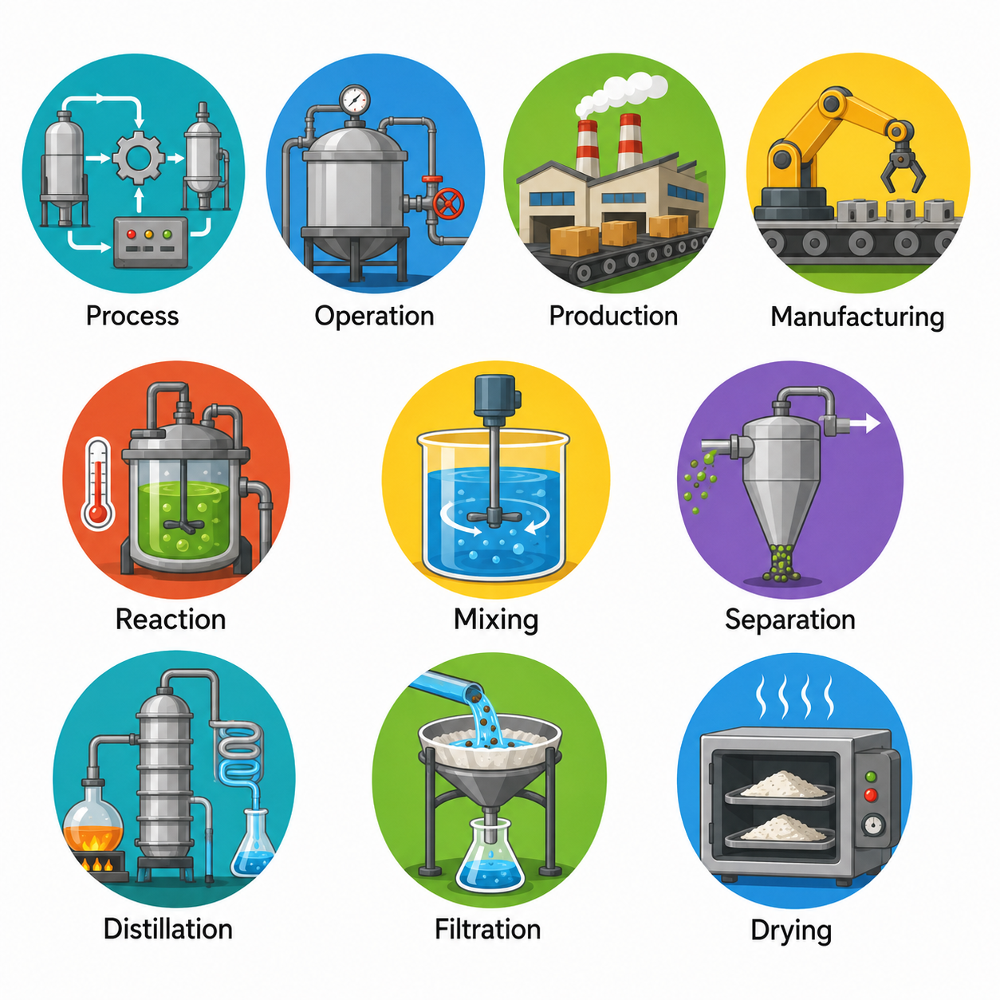
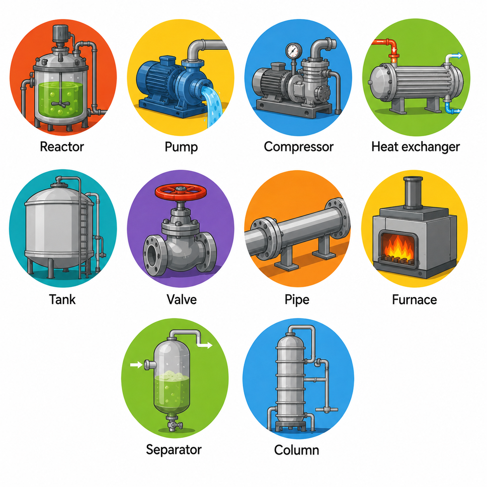
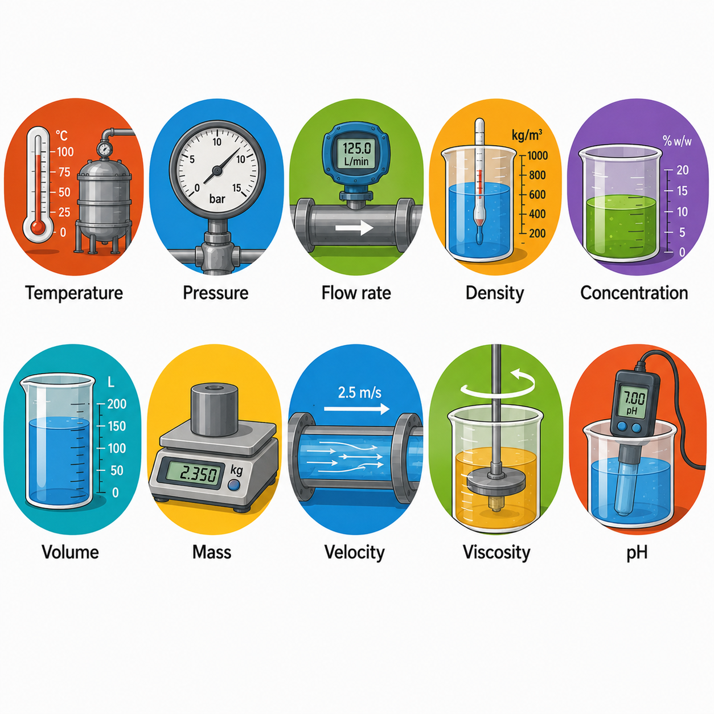
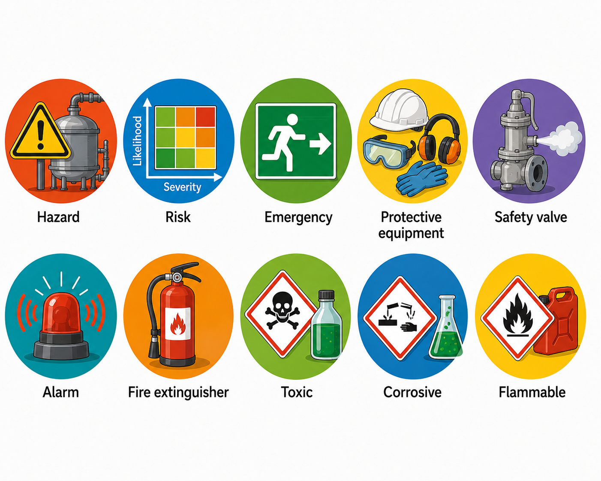
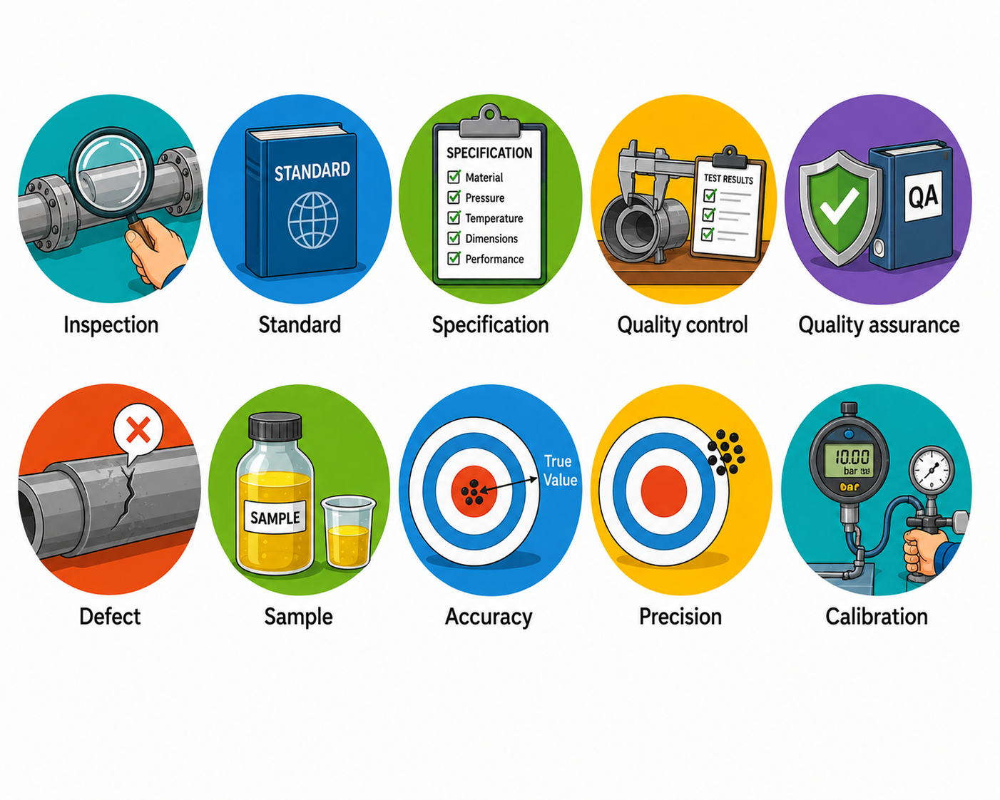

# 🔧 Lesson 2: Technical English Basics

## 🎯 Learning Objectives

By the end of this lesson, you will be able to:

- Understand the importance of technical English in chemical engineering.
- Recognize common technical vocabulary used in engineering.
- Interpret symbols, abbreviations, and measurement units correctly.
- Improve your ability to read technical documents, manuals, and scientific papers.
- Apply technical terms in engineering contexts.

---

# 📘 Main Content

## Introduction to Technical English 🌍

Technical English is a specialized form of English used in science, engineering, technology, and industry. Unlike everyday English, technical English focuses on precision, clarity, and consistency. Every word has a specific meaning, helping engineers communicate ideas accurately and avoid misunderstandings.

Chemical engineers use technical English in laboratory reports, operating manuals, engineering drawings, research papers, equipment specifications, safety procedures, and international standards. Since many engineering companies operate globally, technical English allows professionals from different countries to work together efficiently.

Using the correct technical vocabulary also improves communication between engineers, operators, technicians, suppliers, customers, and regulatory agencies.

💡 **Inferred explanation:** Technical English reduces ambiguity and ensures that engineering information is communicated clearly, especially in environments where safety and accuracy are essential.

---

# 📚 Technical Vocabulary

Technical vocabulary consists of words and expressions that have specific meanings in engineering. Learning these terms is one of the most important steps toward becoming a successful engineer.

Unlike general English words, technical terms are often standardized, meaning they are used consistently around the world.

Below are some of the most common categories of technical vocabulary used in chemical engineering.

---

## 🏭 Process Vocabulary

Process vocabulary describes how materials move and change during manufacturing.

Common terms include:

Example:

*A chemical process converts raw materials into valuable products.*

---

## ⚗️ Equipment Vocabulary

Chemical plants contain many types of equipment.

Examples include:

Example:

*The reactor is the main piece of equipment where the chemical reaction takes place.*

---

## 🌡️ Measurement Vocabulary

Measurements are essential in engineering because every process must be monitored and controlled.

Examples include:

Example:

*The pressure inside the reactor must remain within safe operating limits.*

---

## ⚠️ Safety Vocabulary

Safety is one of the highest priorities in chemical engineering.

Important terms include:

Example:

*Workers must wear protective equipment before entering the production area.*

---

## 📈 Quality Vocabulary

Quality control ensures that products meet technical specifications.

Common terms include:

Example:

*The instrument requires regular calibration to ensure accurate measurements.*

---

# 🔤 Symbols in Engineering

Symbols are used to represent physical quantities, mathematical operations, and engineering concepts.

Using symbols saves space and provides a universal language understood by engineers worldwide.

Some common symbols include:

| Symbol | Meaning |
|---------|---------|
| T | Temperature |
| P | Pressure |
| V | Volume |
| m | Mass |
| Q | Heat |
| F | Force |
| t | Time |
| L | Length |
| ρ | Density |
| η | Efficiency |

For example:

**T = 80 °C**

This means the temperature is 80 degrees Celsius.

Another example:

**P = 5 bar**

This indicates that the pressure is five bar.

Understanding engineering symbols is essential for reading equations, process diagrams, and technical manuals.

---

# 🔠 Common Abbreviations

Abbreviations are shortened forms of words commonly used in engineering documents.

They make communication faster and more efficient.

Some common abbreviations include:

| Abbreviation | Meaning |
|--------------|---------|
| HVAC | Heating, Ventilation, and Air Conditioning |
| PLC | Programmable Logic Controller |
| DCS | Distributed Control System |
| PID | Proportional–Integral–Derivative Controller |
| PPE | Personal Protective Equipment |
| SDS | Safety Data Sheet |
| MSDS | Material Safety Data Sheet |
| CAD | Computer-Aided Design |
| ISO | International Organization for Standardization |
| ASTM | American Society for Testing and Materials |

Example:

*Always wear PPE before entering the laboratory.*

Example:

*The DCS monitors the entire production process.*

Some abbreviations may have different meanings depending on the engineering field, so understanding the context is important.

---

# 📏 Engineering Units

Units describe the measurement of physical quantities.

The International System of Units (SI) is the standard measurement system used in science and engineering worldwide.

## 📐 Base Units

| Quantity | Unit | Symbol |
|----------|------|--------|
| Length | meter | m |
| Mass | kilogram | kg |
| Time | second | s |
| Temperature | kelvin | K |
| Electric current | ampere | A |
| Amount of substance | mole | mol |
| Luminous intensity | candela | cd |

---

## ⚙️ Derived Units

Derived units are created by combining base units.

| Quantity | Unit | Symbol |
|----------|------|--------|
| Force | newton | N |
| Pressure | pascal | Pa |
| Energy | joule | J |
| Power | watt | W |
| Frequency | hertz | Hz |
| Velocity | meter per second | m/s |
| Density | kilogram per cubic meter | kg/m³ |

Example:

The pressure inside a reactor may be measured in **Pa** or **bar**.

The flow rate may be measured in **L/min** or **m³/h**.

---

# 📖 Reading Technical Information

Engineers regularly interpret technical documents that contain symbols, abbreviations, units, charts, and diagrams.

Examples include:

- 📄 Equipment manuals
- 📊 Process flow diagrams
- 📈 Engineering reports
- 📚 Scientific articles
- 🧪 Laboratory procedures
- ⚠️ Safety instructions
- 🏭 Plant operating manuals

Understanding technical English allows engineers to identify important information quickly and accurately.

For example, a process flow diagram may include symbols for pumps, valves, reactors, and storage tanks, while operating conditions are expressed using units such as bar, °C, and m³/h.

---

# 🌎 Why Technical English Matters

Technical English provides many professional advantages.

Engineers with strong technical English skills can:

- 📚 Read international engineering literature.
- 🤝 Communicate with global engineering teams.
- 🏭 Operate industrial equipment safely.
- 📝 Write professional reports.
- 🎤 Deliver technical presentations.
- 🚀 Participate in international projects.
- 🔬 Conduct scientific research.
- 💼 Improve career opportunities.

Since English is the dominant language of science and engineering, mastering technical vocabulary is an investment in long-term professional success.

---

# 📖 Key Vocabulary

| Term | Definition |
|------|------------|
| Process | A sequence of operations that transforms materials. |
| Reactor | Equipment where chemical reactions occur. |
| Pressure | Force applied over an area. |
| Temperature | Degree of hotness or coldness of a substance. |
| Calibration | Adjustment of an instrument for accurate measurements. |
| Specification | Detailed technical requirement. |
| Hazard | A potential source of danger. |
| Density | Mass per unit volume. |
| Flow Rate | Amount of fluid moving through a system over time. |
| Unit | Standard measurement of a quantity. |
| Symbol | Character representing a quantity or concept. |
| Abbreviation | Shortened form of a word or phrase. |
| SI Units | International System of Units used worldwide. |
| PPE | Personal Protective Equipment. |
| Efficiency | Ability to achieve maximum output with minimum waste. |

---

# ✏️ Exercise 1 — Match the Vocabulary 🧩

Match each engineering term with its correct definition.

| Term | Definition |
|------|------------|
| 1. Reactor | A. Standard measurement |
| 2. Hazard | B. Equipment where reactions occur |
| 3. Calibration | C. Potential source of danger |
| 4. Unit | D. Instrument adjustment |
| 5. Density | E. Mass per unit volume |

Show answers

1 → B

2 → C

3 → D

4 → A

5 → E

---

# ✏️ Exercise 2 — Fill in the Blanks 📝

**Word Bank**

- pressure
- reactor
- PPE
- calibration
- symbol
- units

1. Engineers measure temperature and pressure using standard __________.

2. The chemical reaction takes place inside the __________.

3. Workers should always wear __________ in hazardous areas.

4. Regular __________ improves measurement accuracy.

5. The letter **P** is the __________ for pressure.

Show answers

1. units

2. reactor

3. PPE

4. calibration

5. symbol

---

# ✏️ Exercise 3 — Vocabulary in Context 🚀

Answer the following questions using complete sentences.

1. Why is technical vocabulary important in engineering?

2. What is the difference between a symbol and an abbreviation?

3. Why do engineers use SI units?

4. Name five pieces of equipment commonly found in a chemical plant.

5. Why is calibration important for engineering instruments?

Show answers

1. Technical vocabulary helps engineers communicate accurately and avoid misunderstandings.

2. A symbol represents a physical quantity or concept (such as **P** for pressure), while an abbreviation is a shortened form of a word or phrase (such as **PPE** for Personal Protective Equipment).

3. Engineers use SI units because they provide an internationally accepted and standardized measurement system.

4. Possible answers include reactor, pump, valve, heat exchanger, compressor, separator, tank, furnace, and column.

5. Calibration ensures that instruments provide accurate and reliable measurements, improving safety and product quality.

---

# ✅ Lesson Summary

In this lesson, you learned:

- 🔧 What technical English is and why it is important.
- 📚 Essential technical vocabulary used in chemical engineering.
- 🔤 Common engineering symbols and abbreviations.
- 📏 The most important SI units and engineering measurements.
- 🌍 How technical English supports communication, safety, and professional development in engineering.

Mastering technical English enables chemical engineers to read technical documents confidently, communicate effectively with international teams, and perform engineering tasks accurately and safely.