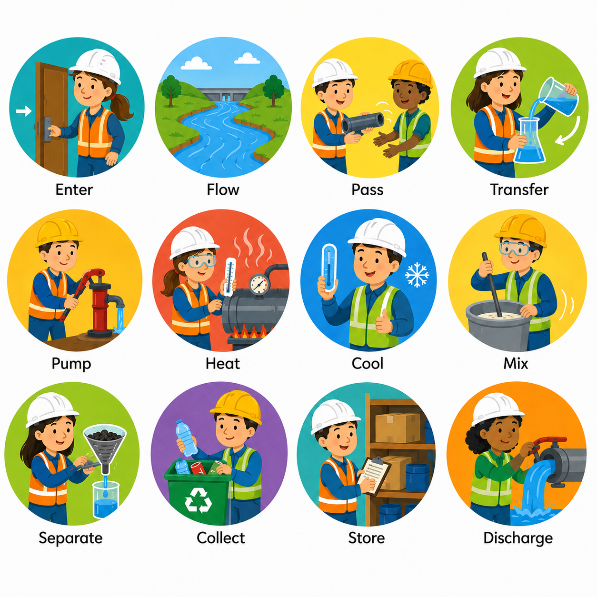

# 🏭 Lesson 3: Technical Descriptions

## 🎯 Learning Objectives

By the end of this lesson, you will be able to:

- Describe industrial processes using appropriate technical English.
- Identify the stages of a chemical process.
- Describe the function and operation of common chemical engineering equipment.
- Use technical vocabulary related to processes and equipment.
- Read and understand technical descriptions found in manuals, reports, and engineering documents.

---

# 📘 Main Content

## Introduction to Technical Descriptions 📝

Technical descriptions explain how a process, system, or piece of equipment works. They are commonly found in engineering manuals, operating procedures, laboratory reports, research papers, maintenance guides, and equipment specifications.

Unlike everyday descriptions, technical descriptions are objective, precise, and well organized. Their purpose is to communicate information clearly so that engineers, operators, technicians, and other professionals understand exactly what happens during a process or how equipment functions.

In chemical engineering, technical descriptions often answer questions such as:

- What is the purpose of the process?
- How does the process work?
- What equipment is used?
- What materials enter and leave the system?
- What operating conditions are required?
- What safety precautions should be followed?

💡 **Inferred explanation:** Well-written technical descriptions reduce misunderstandings, improve safety, and support efficient operation in industrial environments.

---

# ⚙️ Describing Processes

A **process** is a sequence of operations that transforms raw materials into useful products. Every industrial process follows a logical order, with each step contributing to the final result.

When describing a process, engineers usually explain:

- 🎯 The purpose of the process
- 🧪 The raw materials used
- 🔥 The operating conditions
- ⚙️ The equipment involved
- 📦 The final products
- ♻️ Waste or by-products generated

A good process description follows the order in which the operations occur.

---

## 🏭 Typical Process Description

Consider the production of purified water.

1. Water enters the treatment system.
2. Large particles are removed through filtration.
3. Chemicals are added to eliminate impurities.
4. The water passes through additional purification stages.
5. The treated water is tested for quality.
6. Finally, the purified water is stored for distribution.

Each step is presented in chronological order, making the description easy to follow.

---

## 🔄 Sequence Words

Engineers use sequence words to explain the order of operations.

Common sequence words include:

- First
- Initially
- Next
- Then
- After that
- Subsequently
- Meanwhile
- Finally
- At the end of the process

### Example

**First**, the raw materials are mixed.

**Next**, the mixture enters the reactor.

**Then**, heat is applied to start the reaction.

**Finally**, the product is cooled and stored.

These connectors improve clarity and organization.

---

## ⚗️ Describing Process Conditions

Chemical processes operate under carefully controlled conditions.

Engineers commonly describe:

- 🌡️ Temperature
- 📈 Pressure
- 💧 Flow rate
- ⏱️ Reaction time
- ⚖️ Concentration
- 🔥 Heating and cooling conditions

### Example

The reactor operates at **200 °C** and **10 bar**. The reaction continues for **three hours**, while the pressure is continuously monitored to maintain safe operating conditions.

Providing numerical values makes technical descriptions more accurate and useful.

---

## 📊 Process Flow

Many technical descriptions explain how materials move through a system.

Typical verbs include:

- Enter
- Flow
- Pass
- Transfer
- Pump
- Heat
- Cool
- Mix
- Separate
- Collect
- Store
- Discharge

### Example

The liquid enters the storage tank. It is then pumped to the heat exchanger, where its temperature increases before it flows into the reactor.

These action verbs help describe the movement of materials throughout the plant.

---

# 🏗️ Describing Equipment

Chemical plants contain many different types of equipment. Engineers must describe each component accurately to support installation, operation, maintenance, and troubleshooting.

Equipment descriptions usually include:

- 📌 Name
- 🎯 Purpose
- ⚙️ Function
- 📍 Location
- 🧱 Construction material
- 📏 Capacity
- 🔥 Operating conditions
- 🛠️ Maintenance requirements

---

## ⚗️ Reactor

A **reactor** is the equipment where chemical reactions occur.

Typical description:

A reactor is designed to provide controlled conditions for chemical reactions. It maintains the required temperature, pressure, and mixing conditions to maximize product yield while ensuring safe operation.

---

## 🌡️ Heat Exchanger

A **heat exchanger** transfers heat between two fluids without allowing them to mix.

Typical description:

The heat exchanger increases or decreases the temperature of process fluids. It improves energy efficiency by recovering heat from one stream and transferring it to another.

---

## 🚰 Pump

A **pump** moves liquids from one location to another.

Typical description:

The centrifugal pump transports liquid through pipelines at the required flow rate. Regular inspection helps maintain reliable operation.

---

## 🛢️ Storage Tank

Storage tanks temporarily hold liquids or gases.

Typical description:

The storage tank provides safe containment before materials enter the production process or after the finished product is manufactured.

---

## 🚪 Valve

Valves regulate fluid movement.

Typical description:

The control valve adjusts the flow rate inside the pipeline, allowing operators to regulate pressure and process conditions.

---

## 🧪 Distillation Column

A distillation column separates liquid mixtures according to differences in boiling point.

Typical description:

Inside the column, vapor rises while liquid flows downward. Components separate through repeated evaporation and condensation until high-purity products are obtained.

---

# ✍️ Writing Effective Technical Descriptions

Good technical descriptions share several characteristics.

They are:

|         | ✅ Good Example                                                             | ❌ Bad Example                                                                                                                                       |
| -------------- | -------------------------------------------------------------------------- | --------------------------------------------------------------------------------------------------------------------------------------------------- |
| **Clear**      | "Submit the report by **5:00 PM on Friday**."                              | "Get it done sometime soon."                                                                                                                        |
| **Accurate**   | "Water boils at **100°C at sea level**."                                   | "Water always boils at **80°C**."                                                                                                                   |
| **Objective**  | "The survey found that **75% of participants preferred online learning**." | "Online learning is obviously the best way to study."                                                                                               |
| **Logical**    | "The battery is dead, so the phone won't turn on."                         | "The battery is dead, so the phone's camera takes better pictures."                                                                                 |
| **Concise**    | "The meeting starts at **9:00 AM**."                                       | "The meeting, which everyone has been waiting for and that was mentioned several times before, will begin at approximately 9:00 AM in the morning." |
| **Consistent** | "The document refers to the product as **'SmartWatch X'** throughout."     | "The document calls the product **'SmartWatch X,' 'Watch X,' 'Smart X,'** and **'Device X'** interchangeably without explanation.**                 |

Engineers avoid vague expressions and instead provide measurable information whenever possible.

Instead of writing:

*"The reactor is very hot."*

A technical description would state:

*"The reactor operates at 250 °C during normal production."*

This version is much more precise and useful.

---

# 📄 Technical Descriptions in Engineering Documents

Technical descriptions appear in many engineering documents, including:

- 📘 Operating manuals
- 📋 Standard operating procedures (SOPs)
- 📊 Process flow diagrams (PFDs)
- ⚙️ Piping and Instrumentation Diagrams (P&IDs)
- 📑 Equipment specifications
- 🔬 Laboratory reports
- 🧾 Maintenance manuals
- 📈 Engineering reports
- ⚠️ Safety procedures

Understanding these documents is an essential skill for every chemical engineer.

---

# 🌍 Importance of Technical Descriptions

Technical descriptions help engineers:

- 🤝 Communicate with multidisciplinary teams.
- ⚠️ Improve workplace safety.
- 📈 Increase production efficiency.
- 🔍 Diagnose operational problems.
- 🛠️ Plan maintenance activities.
- 📚 Train new employees.
- 🌎 Work on international engineering projects.

Accurate descriptions reduce errors, improve productivity, and support consistent plant operation.

---

# 📖 Key Vocabulary

| Term | Definition |
|------|------------|
| Process | A sequence of operations that transforms materials. |
| Reactor | Equipment where chemical reactions occur. |
| Heat Exchanger | Equipment that transfers heat between fluids. |
| Pump | Machine that moves liquids through a system. |
| Valve | Device used to control fluid flow. |
| Storage Tank | Vessel used to store liquids or gases. |
| Distillation | Separation process based on boiling points. |
| Flow Rate | Quantity of fluid moving through a system over time. |
| Operating Conditions | Temperature, pressure, flow rate, and other process variables. |
| Pipeline | System of connected pipes used to transport fluids. |
| Filtration | Process of removing solid particles from a fluid. |
| Separation | Process of dividing mixtures into components. |
| Maintenance | Activities performed to keep equipment operating properly. |
| Specification | Technical description of equipment or materials. |
| Efficiency | Ability to achieve maximum output with minimum waste. |

---

# ✏️ Exercise 1 — Match the Vocabulary 🧩

Match each term with its correct definition.

| Term | Definition |
|------|------------|
| 1. Pump | A. Transfers heat between fluids |
| 2. Valve | B. Controls fluid flow |
| 3. Reactor | C. Moves liquids |
| 4. Heat Exchanger | D. Chemical reaction vessel |
| 5. Storage Tank | E. Stores liquids or gases |

Show answers

1 → C

2 → B

3 → D

4 → A

5 → E

---

# ✏️ Exercise 2 — Fill in the Blanks 📝

**Word Bank**

- reactor
- pressure
- valve
- sequence
- filtration
- heat exchanger

1. The __________ removes solid particles from a liquid.

2. The __________ controls the flow of fluid in a pipeline.

3. Engineers often describe processes using __________ words such as *first* and *finally*.

4. Chemical reactions occur inside the __________.

5. The __________ transfers thermal energy between two fluids.

6. The operating __________ must remain within safe limits.

Show answers

1. filtration

2. valve

3. sequence

4. reactor

5. heat exchanger

6. pressure

---

# ✏️ Exercise 3 — Vocabulary in Context 🚀

Answer the following questions using complete sentences.

1. Why are technical descriptions important in chemical engineering?

2. What information is usually included in a process description?

3. Name four pieces of equipment commonly found in a chemical plant and describe their functions.

4. Why are numerical operating conditions included in technical descriptions?

5. How do sequence words improve a process description?

Show answers

1. Technical descriptions communicate engineering information clearly, improve safety, and reduce misunderstandings.

2. A process description usually includes the purpose, raw materials, operating conditions, equipment, sequence of operations, products, and waste or by-products.

3. Possible answers include:
   - Reactor: carries out chemical reactions.
   - Pump: moves liquids.
   - Heat exchanger: transfers heat.
   - Valve: controls fluid flow.
   - Storage tank: stores materials.
   - Distillation column: separates liquid mixtures.

4. Numerical operating conditions provide accurate and measurable information that helps engineers operate equipment safely and efficiently.

5. Sequence words organize the steps of a process, making technical descriptions easier to understand and follow.

---

# ✅ Lesson Summary

In this lesson, you learned:

- 🏭 How to describe industrial processes clearly and logically.
- ⚙️ How to describe the purpose and function of common chemical engineering equipment.
- 🔄 The importance of sequence words in technical descriptions.
- 🌡️ How operating conditions such as temperature and pressure are included in engineering documents.
- 📚 Essential vocabulary for reading and writing technical descriptions.

Being able to describe processes and equipment accurately is a fundamental communication skill for chemical engineers. It supports safe plant operation, effective teamwork, and professional technical documentation.