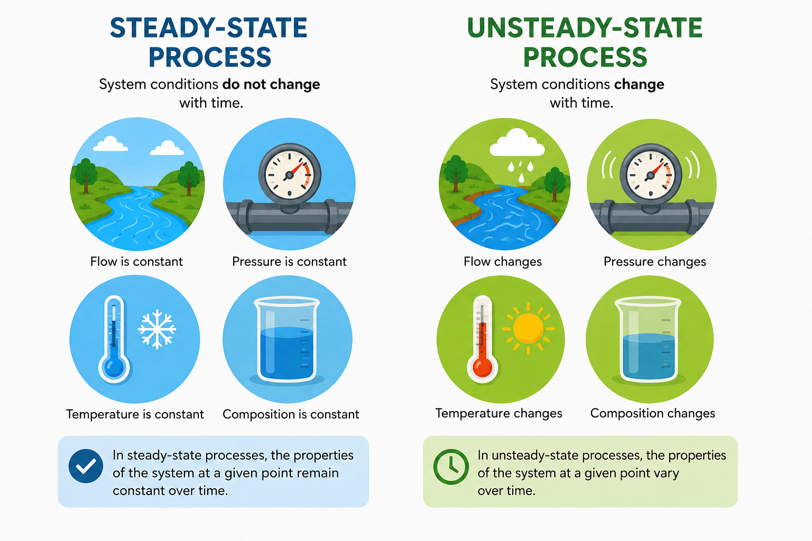

# ⚖️ Lesson 8: Material Balances

## 🎯 Learning Objectives

By the end of this lesson, you will be able to:

- Understand the concept of material (mass) balances in chemical engineering.
- Explain the law of conservation of mass.
- Identify the components of a material balance.
- Perform simple material balance calculations.
- Apply technical vocabulary related to mass balances and process analysis.

---

# 📘 Main Content

## Introduction to Material Balances 🏭

Material balances, also called **mass balances**, are one of the most important tools in chemical engineering. Engineers use them to calculate how much material enters, leaves, accumulates, or reacts within a process.

Whether designing a new chemical plant, improving an existing process, or analyzing laboratory experiments, engineers rely on material balances to understand the movement of materials through a system.

Material balances are used in industries such as:

- 🛢️ Petroleum refining
- 💊 Pharmaceutical manufacturing
- 🍎 Food processing
- 🌱 Biotechnology
- ♻️ Environmental engineering
- ⚡ Energy production

A correct material balance helps engineers improve efficiency, reduce waste, optimize production, and ensure safe operation.

💡 **Inferred explanation:** Material balances provide a mathematical description of how materials move through a process, allowing engineers to predict and control industrial operations.

---

# ⚖️ Law of Conservation of Mass

Material balances are based on the **Law of Conservation of Mass**.

This law states that:

> **Mass cannot be created or destroyed; it can only be transferred or transformed.**

In a chemical process, the total mass entering a system must equal the total mass leaving the system plus any mass that accumulates or is consumed or produced by chemical reactions.

For a simple process without chemical reactions:

**Mass In = Mass Out**

Example:

If **500 kg** of water enters a storage tank and no water is added or removed during filling, the tank contains **500 kg** of water.

This principle applies to every engineering process, regardless of its size.

---

# 🏭 What Is a System?

A **system** is the portion of a process selected for analysis.

Everything outside the system is called the **surroundings**.

The boundary between the system and its surroundings is known as the **system boundary**.

Engineers define systems to simplify calculations and focus on specific equipment or processes.

Examples of systems include:

- A reactor
- A storage tank
- A heat exchanger
- An entire production plant
- A mixing vessel

Clearly defining the system is the first step in solving a material balance.

---

# 📥 Inputs and Outputs

Every process has **inputs** and **outputs**.

### 📥 Input (Inlet)

An input is any material entering the system.

Examples:

- Raw materials
- Water
- Air
- Steam
- Catalysts
- Recycled streams

### 📤 Output (Outlet)

An output is any material leaving the system.

Examples:

- Final products
- Waste streams
- By-products
- Exhaust gases
- Recycle streams

Tracking all input and output streams is essential for an accurate material balance.

---

# 🧪 General Material Balance Equation

The general material balance equation is:

**Input + Generation = Output + Consumption + Accumulation**

Where:

- **Input** = Material entering the system
- **Generation** = Material produced by chemical reactions
- **Output** = Material leaving the system
- **Consumption** = Material used in chemical reactions
- **Accumulation** = Material stored within the system

This equation applies to both simple and complex chemical processes.

---

# 🔄 Steady-State and Unsteady-State Processes

## ⚙️ Steady-State Process

A process operates at **steady state** when conditions remain constant over time.

Characteristics:

- No accumulation of material.
- Input equals output (if there is no reaction).
- Process variables remain stable.

Example:

A continuously operating pipeline carrying water at a constant flow rate.

---

## ⏳ Unsteady-State Process

A process is **unsteady state** when conditions change with time.

Characteristics:

- Material accumulates or decreases.
- Flow rates may change.
- Process variables vary.

Example:

A storage tank being filled or emptied.

Understanding the difference between steady-state and unsteady-state processes helps engineers select the correct balance equations.

---

# ⚗️ Material Balances with Chemical Reactions

When chemical reactions occur, some substances are consumed while others are produced.

Example:

Hydrogen reacts with oxygen to produce water.

Although the individual substances change, the **total mass remains constant**.

Engineers account for:

- Reactants consumed
- Products generated
- Unreacted materials
- Recycle streams
- By-products

Material balances help determine reaction yields and process efficiency.

---

# 📊 Applications of Material Balances

Material balances are used in many engineering activities.

Examples include:

- 🏭 Process design
- 📈 Production planning
- ⚙️ Equipment sizing
- ♻️ Waste reduction
- 🌱 Environmental protection
- 🧪 Laboratory analysis
- 🔍 Process troubleshooting
- 📋 Quality control

Accurate material balances improve productivity and reduce operating costs.

---

# 📄 Material Balance in Process Flow Diagrams

Process Flow Diagrams (PFDs) often include stream information needed for material balances.

Typical stream data include:

- Stream number
- Flow rate
- Temperature
- Pressure
- Composition

Engineers use this information to calculate unknown values and verify process performance.

---

# 🌍 Why Material Balances Are Important

Material balances allow engineers to:

- Improve process efficiency.
- Detect material losses.
- Identify leaks.
- Optimize raw material usage.
- Reduce production costs.
- Increase product yield.
- Improve environmental performance.
- Ensure safe plant operation.

Nearly every chemical engineering calculation begins with a material balance.

---

# 📖 Key Vocabulary

| Term | Definition |
|------|------------|
| Material Balance | Calculation based on the conservation of mass. |
| Mass Balance | Another name for a material balance. |
| System | Portion of a process selected for analysis. |
| System Boundary | Imaginary line separating a system from its surroundings. |
| Input | Material entering a system. |
| Output | Material leaving a system. |
| Accumulation | Material stored within a system over time. |
| Generation | Material produced by a chemical reaction. |
| Consumption | Material used during a chemical reaction. |
| Steady State | Process operating with no accumulation. |
| Unsteady State | Process where conditions change with time. |
| Flow Rate | Amount of material moving through a system over time. |
| Reactant | Substance consumed during a chemical reaction. |
| Product | Substance formed during a chemical reaction. |
| Conservation of Mass | Principle stating that mass cannot be created or destroyed. |

---

# ✏️ Exercise 1 — Match the Vocabulary 🧩

Match each term with its correct definition.

| Term | Definition |
|------|------------|
| 1. System | A. Material entering a process |
| 2. Input | B. Process with no accumulation |
| 3. Steady State | C. Portion selected for analysis |
| 4. Accumulation | D. Material stored in the system |
| 5. Product | E. Substance formed by a reaction |

Show answers

1 → C

2 → A

3 → B

4 → D

5 → E

---

# ✏️ Exercise 2 — Fill in the Blanks 📝

**Word Bank**

- conservation
- output
- steady state
- accumulation
- reactant
- flow rate

1. The law of __________ of mass states that mass cannot be created or destroyed.

2. Material leaving a system is called the __________.

3. In a __________ process, there is no accumulation of material.

4. Material stored inside a system is called __________.

5. A substance consumed during a chemical reaction is a __________.

6. The quantity of material moving through a pipe per unit time is called the __________.

Show answers

1. conservation

2. output

3. steady state

4. accumulation

5. reactant

6. flow rate

---

# ✏️ Exercise 3 — Vocabulary in Context 🚀

Answer the following questions using complete sentences.

1. What is the law of conservation of mass?

2. What is the difference between a steady-state process and an unsteady-state process?

3. Why is it important to define the system boundary before performing a material balance?

4. Name four industrial applications of material balances.

5. A mixing tank receives **300 kg** of water and **200 kg** of ethanol, with no outlet stream. What is the total mass in the tank?

Show answers

1. The law of conservation of mass states that mass cannot be created or destroyed; it can only be transferred or transformed.

2. A steady-state process has no accumulation of material, while an unsteady-state process has changing conditions and accumulation or depletion over time.

3. The system boundary identifies which material streams enter and leave the system, allowing engineers to perform accurate calculations.

4. Possible answers include process design, equipment sizing, production planning, quality control, waste reduction, environmental protection, laboratory analysis, and process troubleshooting.

5. The total mass is **500 kg** (300 kg + 200 kg).

---

# ✅ Lesson Summary

In this lesson, you learned:

- ⚖️ The concept of material (mass) balances and their importance in chemical engineering.
- 🏭 The law of conservation of mass and how it forms the basis of all material balance calculations.
- 📥 The difference between inputs, outputs, generation, consumption, and accumulation.
- 🔄 The characteristics of steady-state and unsteady-state processes.
- 🧮 How to solve simple material balance problems using practical examples.
- 📚 Essential technical vocabulary related to material balances.

Material balances are one of the fundamental analytical tools in chemical engineering. They help engineers design efficient processes, optimize resource use, improve product quality, reduce waste, and ensure safe and reliable plant operation.