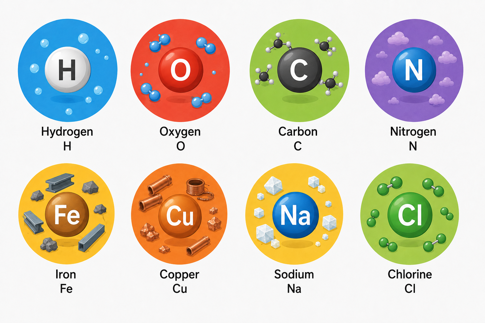
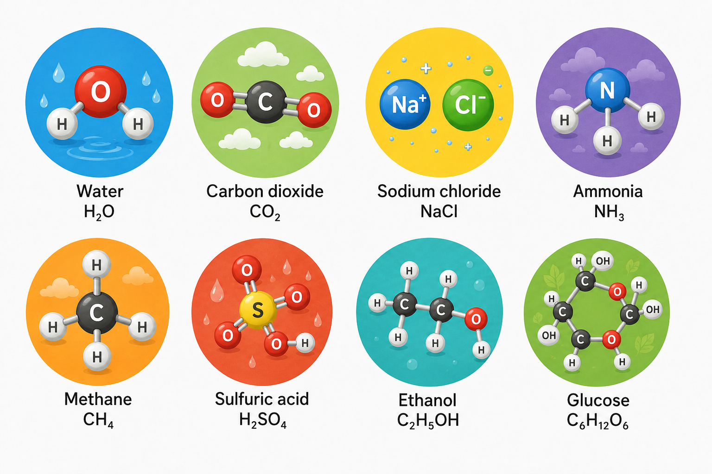

# 🧪 Lesson 10: Chemical Substances

## 🎯 Learning Objectives

By the end of this lesson, you will be able to:

- Understand the difference between elements, compounds, mixtures, and solutions.
- Identify common chemical substances used in chemical engineering.
- Explain the properties of pure substances and mixtures.
- Apply technical vocabulary related to chemical substances.
- Use appropriate technical English when describing materials in engineering contexts.

---

# 📘 Main Content

## Introduction to Chemical Substances 🌍

Chemical engineering is based on the study and transformation of chemical substances. Every industrial process involves materials that are processed, separated, purified, reacted, or combined to produce useful products.

Chemical substances can be classified into several categories, including **elements**, **compounds**, **mixtures**, and **solutions**. Understanding these categories helps engineers select raw materials, design production processes, and ensure product quality.

Chemical engineers work with thousands of different substances in industries such as:

- 🛢️ Petroleum refining
- 💊 Pharmaceuticals
- 🍎 Food processing
- 🌱 Biotechnology
- ♻️ Environmental engineering
- ⚡ Energy production
- 🧴 Cosmetics
- 🧪 Specialty chemicals

💡 **Inferred explanation:** Correctly identifying chemical substances allows engineers to predict their behavior during chemical reactions, separation processes, and industrial operations.

---

# ⚛️ Elements

An **element** is a pure substance made of only one type of atom. Elements cannot be broken down into simpler substances by ordinary chemical methods.

Each element has:

- A unique atomic number
- A chemical symbol
- Specific physical and chemical properties

Examples include:

Elements are the basic building blocks of all matter.

### Engineering Applications

Chemical engineers use elements in many industrial processes.

Examples:

- Hydrogen is used in ammonia production and fuel cells.
- Oxygen supports combustion and wastewater treatment.
- Carbon is used in activated carbon filters and composite materials.
- Iron is a major component of industrial equipment and construction materials.

---

# 🧬 Compounds

A **compound** is a pure substance formed when two or more different elements are chemically bonded in fixed proportions.

Unlike mixtures, compounds have consistent compositions and unique chemical properties.

Examples include:

Compounds can only be separated into their elements through chemical reactions.

### Engineering Applications

Compounds are essential in industrial manufacturing.

Examples:

- Water is used as a solvent and coolant.
- Sulfuric acid is widely used in fertilizer production.
- Ammonia is an important raw material for fertilizers.
- Methane is the primary component of natural gas.
- Ethanol is used as a solvent and biofuel.

---

# ⚖️ Pure Substances

A **pure substance** has a constant chemical composition and uniform properties throughout the sample.

Pure substances include:

- Elements
- Compounds

Characteristics:

- Fixed composition
- Uniform properties
- Definite melting and boiling points
- Predictable behavior during chemical processes

Engineers often require high-purity substances to ensure product quality and reliable process performance.

---

# 🧪 Mixtures

A **mixture** is a combination of two or more substances that are physically combined rather than chemically bonded.

Each component retains its own chemical properties.

Mixtures can have different compositions depending on how much of each substance is present.

Examples:

- Air
- Crude oil
- Seawater
- Soil
- Concrete
- Milk

Mixtures can usually be separated by physical methods.

---

## 🔄 Types of Mixtures

### 🌈 Homogeneous Mixtures

A homogeneous mixture has a uniform composition throughout.

Examples:

- Saltwater
- Air
- Vinegar
- Gasoline

The components cannot be distinguished by the naked eye.

---

### 🌪️ Heterogeneous Mixtures

A heterogeneous mixture has a non-uniform composition.

Examples:

- Oil and water
- Sand in water
- Concrete
- Salad

The different components remain visibly separate.

---

# 💧 Solutions

A **solution** is a homogeneous mixture in which one substance dissolves completely in another.

Solutions are among the most common materials handled in chemical engineering.

Every solution contains:

- **Solvent** – the substance present in the larger amount.
- **Solute** – the substance dissolved in the solvent.

Example:

Salt dissolved in water forms a salt solution.

- Solvent = Water
- Solute = Salt

---

## 🧪 Types of Solutions

Solutions can exist in different phases.

### Liquid Solutions

Examples:

- Sugar in water
- Saltwater
- Ethanol in water

---

### Gas Solutions

Example:

Air is a solution composed mainly of nitrogen and oxygen.

---

### Solid Solutions

Example:

Many metal alloys are solid solutions.

Brass is a mixture of copper and zinc.

---

# ⚙️ Concentration of Solutions

The **concentration** of a solution describes how much solute is dissolved in a given amount of solvent or solution.

Common concentration units include:

- mol/L
- g/L
- %
- ppm (parts per million)
- mg/L

Example:

A sodium chloride solution has a concentration of **5 g/L**.

Higher concentrations contain more dissolved solute.

---

# 🧪 Common Separation Methods

Chemical engineers frequently separate mixtures into their components.

Common separation techniques include:

### 🌡️ Distillation

Separates liquids based on differences in boiling points.

Applications:

- Petroleum refining
- Alcohol production
- Water purification

---

### 🧴 Filtration

Separates solids from liquids or gases using a filter.

Applications:

- Water treatment
- Food production
- Pharmaceutical manufacturing

---

### 💨 Evaporation

Removes a liquid by converting it into vapor.

Applications:

- Salt production
- Wastewater treatment
- Food processing

---

### 🧲 Centrifugation

Separates materials using rotational force.

Applications:

- Blood analysis
- Dairy processing
- Biotechnology

---

### 🧪 Crystallization

Produces solid crystals from a solution.

Applications:

- Sugar production
- Pharmaceutical manufacturing
- Chemical purification

---

# 🏭 Chemical Substances in Industry

Chemical engineers work with many different substances every day.

Examples include:

- 🌱 Fertilizers
- 💊 Medicines
- 🛢️ Petroleum products
- 🧴 Detergents
- 🍎 Food additives
- 🧪 Industrial gases
- ♻️ Recycled materials
- ⚡ Battery chemicals

Selecting the correct chemical substances is essential for producing safe, efficient, and high-quality products.

---

# 📄 Chemical Information in Engineering Documents

Information about chemical substances appears in many engineering documents, including:

- 📘 Safety Data Sheets (SDS)
- 📋 Equipment manuals
- 📊 Process Flow Diagrams (PFDs)
- 🔧 Piping and Instrumentation Diagrams (P&IDs)
- 🧪 Laboratory reports
- 📈 Technical specifications
- ⚠️ Operating procedures

Engineers must understand the properties of each substance before handling or processing it.

---

# 🌍 Importance of Understanding Chemical Substances

Knowledge of chemical substances helps engineers to:

- Design industrial processes.
- Select appropriate raw materials.
- Predict chemical reactions.
- Improve product quality.
- Reduce environmental impact.
- Operate equipment safely.
- Handle hazardous chemicals responsibly.
- Comply with environmental and safety regulations.

Understanding the properties of materials is one of the most important foundations of chemical engineering.

---

# 📖 Key Vocabulary

| Term | Definition |
|------|------------|
| Element | Pure substance consisting of one type of atom. |
| Compound | Substance formed by chemically bonded elements. |
| Mixture | Physical combination of two or more substances. |
| Solution | Homogeneous mixture of a solute and a solvent. |
| Solute | Substance dissolved in a solvent. |
| Solvent | Substance that dissolves the solute. |
| Homogeneous | Having a uniform composition throughout. |
| Heterogeneous | Having a non-uniform composition. |
| Concentration | Amount of solute dissolved in a given quantity of solvent or solution. |
| Pure Substance | Material with a fixed chemical composition. |
| Distillation | Separation based on boiling point differences. |
| Filtration | Separation of solids from fluids using a filter. |
| Crystallization | Formation of solid crystals from a solution. |
| Separation | Process of dividing a mixture into its components. |
| Chemical Formula | Symbolic representation of a compound's composition. |

---

# ✏️ Exercise 1 — Match the Vocabulary 🧩

Match each term with its correct definition.

| Term | Definition |
|------|------------|
| 1. Element | A. Homogeneous mixture |
| 2. Compound | B. Pure substance made of one type of atom |
| 3. Solution | C. Substance formed by chemically bonded elements |
| 4. Solute | D. Substance dissolved in a solvent |
| 5. Mixture | E. Physical combination of substances |

Show answers

1 → B

2 → C

3 → A

4 → D

5 → E

---

# ✏️ Exercise 2 — Fill in the Blanks 📝

**Word Bank**

- solvent
- homogeneous
- concentration
- filtration
- compound
- heterogeneous

1. Water is the __________ in a saltwater solution.

2. Air is a __________ mixture.

3. The amount of solute dissolved in a solution is called its __________.

4. __________ is a method used to separate solids from liquids.

5. Water (H₂O) is a chemical __________.

6. Oil and water form a __________ mixture.

Show answers

1. solvent

2. homogeneous

3. concentration

4. filtration

5. compound

6. heterogeneous

---

# ✏️ Exercise 3 — Vocabulary in Context 🚀

Answer the following questions using complete sentences.

1. What is the difference between an element and a compound?

2. How does a homogeneous mixture differ from a heterogeneous mixture?

3. What are the solvent and solute in a saltwater solution?

4. Name three separation methods commonly used in chemical engineering and explain what each one does.

5. Why is understanding chemical substances important for chemical engineers?

Show answers

1. An element consists of one type of atom, while a compound consists of two or more different elements chemically bonded together.

2. A homogeneous mixture has a uniform composition throughout, whereas a heterogeneous mixture has a non-uniform composition with visibly different components.

3. In a saltwater solution, water is the solvent and salt is the solute.

4. Possible answers include:
   - Distillation separates liquids based on boiling points.
   - Filtration separates solids from liquids or gases.
   - Crystallization forms solid crystals from a solution.
   - Evaporation removes a liquid by converting it to vapor.
   - Centrifugation separates materials using rotational force.

5. Understanding chemical substances helps engineers design processes, select materials, predict reactions, ensure product quality, operate equipment safely, and comply with safety and environmental regulations.

---

# ✅ Lesson Summary

In this lesson, you learned:

- ⚛️ The characteristics of elements and compounds as pure substances.
- 🧪 The differences between mixtures, homogeneous mixtures, heterogeneous mixtures, and solutions.
- 💧 The roles of solutes and solvents in forming solutions.
- 🔄 Common separation methods such as distillation, filtration, evaporation, centrifugation, and crystallization.
- 📚 Essential technical vocabulary related to chemical substances and their industrial applications.

A thorough understanding of chemical substances is fundamental for chemical engineers. It enables them to design efficient processes, select suitable materials, perform safe operations, and produce high-quality products across a wide range of industries.