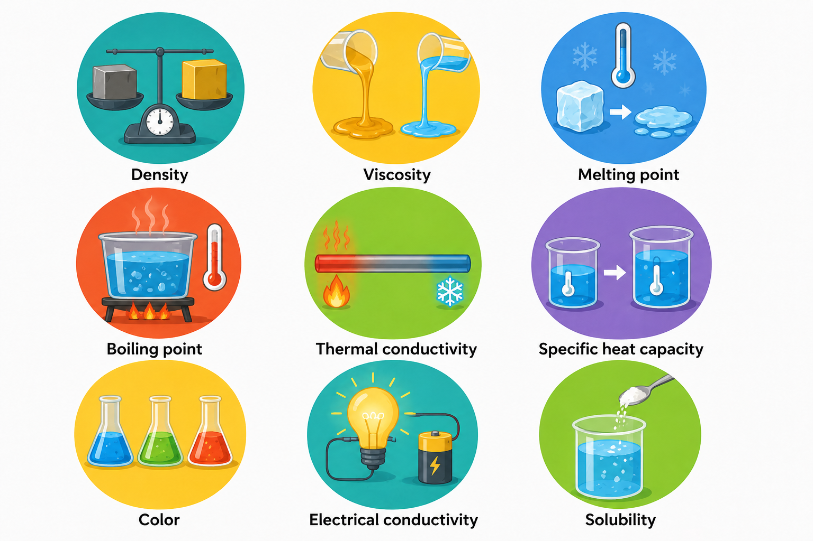

# 🧪 Lesson 12: Physical Properties

## 🎯 Learning Objectives

By the end of this lesson, you will be able to:

- Understand the importance of physical properties in chemical engineering.
- Explain the concepts of density and viscosity.
- Identify key thermal properties used in engineering applications.
- Interpret physical property data in technical documents.
- Apply technical vocabulary related to physical properties.

---

# 📘 Main Content

## Introduction to Physical Properties ⚙️

Every material has characteristics that determine how it behaves under different conditions. These characteristics are known as **physical properties**. Unlike chemical properties, physical properties can usually be observed or measured without changing the chemical composition of the substance.

Chemical engineers use physical properties to:

- 🏭 Design industrial processes
- ⚙️ Select appropriate equipment
- 📊 Predict process performance
- 🌡️ Control operating conditions
- 📋 Ensure product quality
- ♻️ Improve energy efficiency

Physical properties are measured in laboratories and reported in engineering databases, equipment manuals, and technical specifications.

💡 **Inferred explanation:** Knowing the physical properties of a substance allows engineers to predict how it will behave during storage, transportation, heating, cooling, mixing, and separation.

---

# 📏 What Are Physical Properties?

A **physical property** is any characteristic of a material that can be measured without changing its chemical identity.

These properties help engineers compare materials and select the most suitable substance for a specific application.

---

# ⚖️ Density

**Density** is one of the most important physical properties in chemical engineering.

Density is defined as:

> **The mass of a substance per unit volume.**

Formula:

**Density = Mass / Volume**

SI Unit:

**kg/m³**

Other common units include:

- g/cm³
- g/mL

---

## 📊 Understanding Density

Different materials have different densities.

Examples:

| Substance | Approximate Density |
|-----------|--------------------|
| Air | 1.2 kg/m³ |
| Water | 1000 kg/m³ |
| Ethanol | 789 kg/m³ |
| Aluminum | 2700 kg/m³ |
| Steel | 7850 kg/m³ |

A higher density means that more mass is contained within the same volume.

Example:

A steel block and a wooden block may have the same size, but the steel block has a much greater mass because steel has a higher density.

---

## 🏭 Applications of Density

Chemical engineers use density to:

- Calculate material balances.
- Design storage tanks.
- Measure fluid properties.
- Size pipelines and pumps.
- Monitor product quality.
- Separate materials based on density differences.

Density measurements are essential in petroleum refining, food processing, pharmaceuticals, and environmental engineering.

---

# 🌊 Viscosity

**Viscosity** describes a fluid's resistance to flow.

A fluid with high viscosity flows slowly, while a fluid with low viscosity flows easily.

SI Unit:

**Pa·s (pascal-second)**

Industrial measurements may also use:

- mPa·s (millipascal-second)
- cP (centipoise)

---

## 🧴 Examples of Viscosity

| Substance | Relative Viscosity |
|-----------|--------------------|
| Water | Low |
| Gasoline | Low |
| Cooking oil | Medium |
| Syrup | High |
| Honey | Very High |

Honey flows much more slowly than water because it has a higher viscosity.

---

## 🌡️ Effect of Temperature on Viscosity

Temperature has a significant effect on viscosity.

For most liquids:

- As temperature **increases**, viscosity **decreases**.
- As temperature **decreases**, viscosity **increases**.

Example:

Motor oil flows more easily after the engine has warmed up because its viscosity decreases with increasing temperature.

Understanding this relationship helps engineers design efficient pumping and heat transfer systems.

---

## ⚙️ Applications of Viscosity

Viscosity is important for:

- Pump selection
- Pipeline design
- Mixing operations
- Lubrication systems
- Heat exchanger design
- Chemical reactors

Correct viscosity measurements help ensure smooth and efficient process operation.

---

# 🌡️ Thermal Properties

**Thermal properties** describe how materials respond to heat.

These properties are critical when designing heating, cooling, and insulation systems.

Important thermal properties include:

- Specific heat capacity
- Thermal conductivity
- Thermal expansion
- Melting point
- Boiling point

---

# 🔥 Specific Heat Capacity

**Specific heat capacity** is the amount of heat required to raise the temperature of one kilogram of a substance by one degree Celsius (or one kelvin).

SI Unit:

**J/(kg·K)**

Materials with high specific heat require more energy to change temperature.

Example:

Water has a relatively high specific heat capacity, making it an effective coolant in many industrial processes.

---

# 🌡️ Thermal Conductivity

**Thermal conductivity** describes how easily heat passes through a material.

SI Unit:

**W/(m·K)**

Materials with:

- High thermal conductivity transfer heat efficiently.
- Low thermal conductivity act as thermal insulators.

Examples:

| Material | Thermal Conductivity |
|----------|----------------------|
| Copper | High |
| Aluminum | High |
| Stainless Steel | Medium |
| Glass | Low |
| Plastic | Very Low |

Engineers select materials with suitable thermal conductivity for heat exchangers, insulation, and process equipment.

---

# 📏 Thermal Expansion

Most materials expand when heated and contract when cooled.

This behavior is called **thermal expansion**.

Examples:

- Pipelines expand during operation.
- Bridges include expansion joints.
- Storage tanks change slightly in size with temperature.

Engineers must consider thermal expansion when designing equipment to prevent mechanical stress and damage.

---

# ❄️ Melting Point and Boiling Point

The **melting point** is the temperature at which a solid becomes a liquid.

The **boiling point** is the temperature at which a liquid becomes a gas.

Examples:

| Substance | Melting Point | Boiling Point |
|-----------|---------------|---------------|
| Water | 0 °C | 100 °C |
| Ethanol | -114 °C | 78 °C |
| Aluminum | 660 °C | 2,470 °C |

These properties are important in separation processes such as distillation and crystallization.

---

# 🏭 Industrial Applications

Physical properties influence many engineering decisions.

### 🛢️ Petroleum Industry

Engineers measure:

- Density of fuels
- Viscosity of crude oil
- Boiling ranges of hydrocarbons

---

### 💊 Pharmaceutical Industry

Engineers monitor:

- Solution viscosity
- Thermal stability
- Melting points of active ingredients

---

### 🍎 Food Industry

Engineers evaluate:

- Density of beverages
- Viscosity of sauces
- Thermal properties during pasteurization

---

### ♻️ Environmental Engineering

Engineers analyze:

- Water density
- Fluid viscosity
- Heat transfer in treatment systems

Understanding physical properties allows engineers to design efficient and reliable industrial processes.

---

# 📄 Physical Property Data in Engineering Documents

Physical property information appears in many technical resources, including:

- 📘 Equipment manuals
- 📋 Material data sheets
- 🧪 Laboratory reports
- 📊 Process Flow Diagrams (PFDs)
- 📈 Technical specifications
- ⚙️ Engineering databases
- ⚠️ Safety Data Sheets (SDS)

Engineers use these values to perform calculations, select materials, and verify process conditions.

---

# 🌍 Importance of Physical Properties

Understanding physical properties helps engineers to:

- Design safe equipment.
- Select suitable construction materials.
- Optimize heat transfer.
- Improve pumping efficiency.
- Predict material behavior.
- Increase product quality.
- Reduce energy consumption.
- Ensure safe industrial operation.

Accurate physical property data support reliable engineering calculations and better process performance.

---

# 📖 Key Vocabulary

| Term | Definition |
|------|------------|
| Physical Property | Characteristic measured without changing a substance's chemical identity. |
| Density | Mass per unit volume. |
| Viscosity | Resistance of a fluid to flow. |
| Specific Heat Capacity | Heat required to raise the temperature of a unit mass by one degree. |
| Thermal Conductivity | Ability of a material to transfer heat. |
| Thermal Expansion | Increase in size caused by heating. |
| Melting Point | Temperature at which a solid becomes a liquid. |
| Boiling Point | Temperature at which a liquid becomes a gas. |
| Insulator | Material that resists heat transfer. |
| Conductor | Material that transfers heat efficiently. |
| Fluid | Substance that can flow, such as a liquid or gas. |
| Temperature | Measure of how hot or cold a substance is. |
| Heat Transfer | Movement of thermal energy between materials or systems. |
| Material Property | Measurable characteristic used to describe a material. |
| Thermal Stability | Ability of a material to maintain its properties at elevated temperatures. |

---

# ✏️ Exercise 1 — Match the Vocabulary 🧩

Match each term with its correct definition.

| Term | Definition |
|------|------------|
| 1. Density | A. Ability of a material to transfer heat |
| 2. Viscosity | B. Temperature at which a solid becomes a liquid |
| 3. Thermal Conductivity | C. Resistance of a fluid to flow |
| 4. Melting Point | D. Mass per unit volume |
| 5. Thermal Expansion | E. Increase in size caused by heating |

Show answers

1 → D

2 → C

3 → A

4 → B

5 → E

---

# ✏️ Exercise 2 — Fill in the Blanks 📝

**Word Bank**

- density
- viscosity
- specific heat capacity
- thermal conductivity
- boiling point
- conductor

1. __________ is the mass of a substance per unit volume.

2. Honey has a higher __________ than water.

3. Water has a relatively high __________, making it an effective coolant.

4. Copper has excellent __________ and is widely used in heat exchangers.

5. The temperature at which a liquid becomes a gas is its __________.

6. A material that transfers heat efficiently is called a __________.

Show answers

1. density

2. viscosity

3. specific heat capacity

4. thermal conductivity

5. boiling point

6. conductor

---

# ✏️ Exercise 3 — Vocabulary in Context 🚀

Answer the following questions using complete sentences.

1. What is the difference between density and viscosity?

2. Why does the viscosity of most liquids decrease as temperature increases?

3. Why is thermal conductivity important when selecting materials for a heat exchanger?

4. Name three industries where physical property data are essential and explain why.

5. How do physical properties help chemical engineers design safe and efficient processes?

Show answers

1. Density is the mass per unit volume of a substance, while viscosity is a fluid's resistance to flow.

2. As temperature increases, the molecules in most liquids move more freely, reducing internal resistance and lowering viscosity.

3. Heat exchangers require materials with high thermal conductivity so that heat can be transferred efficiently between fluids.

4. Possible answers include:
   - Petroleum refining to measure fuel density and crude oil viscosity.
   - Pharmaceutical manufacturing to control solution properties and thermal stability.
   - Food processing to monitor viscosity, density, and heating conditions.
   - Environmental engineering to analyze water properties and heat transfer.

5. Physical properties help engineers select materials, size equipment, optimize heat transfer, improve fluid flow, reduce energy consumption, and maintain safe operating conditions.

---

# ✅ Lesson Summary

In this lesson, you learned:

- 📏 The role of physical properties in chemical engineering.
- ⚖️ How density describes the mass of a substance per unit volume.
- 🌊 How viscosity measures a fluid's resistance to flow and how temperature affects it.
- 🌡️ Key thermal properties, including specific heat capacity, thermal conductivity, thermal expansion, melting point, and boiling point.
- 🏭 Practical applications of physical properties in industries such as petroleum refining, pharmaceuticals, food processing, and environmental engineering.
- 📚 Essential technical vocabulary related to physical properties.

Understanding physical properties is fundamental for chemical engineers. These properties influence material selection, equipment design, process efficiency, product quality, and safety. Accurate physical property data enable engineers to make informed decisions throughout the design, operation, and optimization of chemical processes.