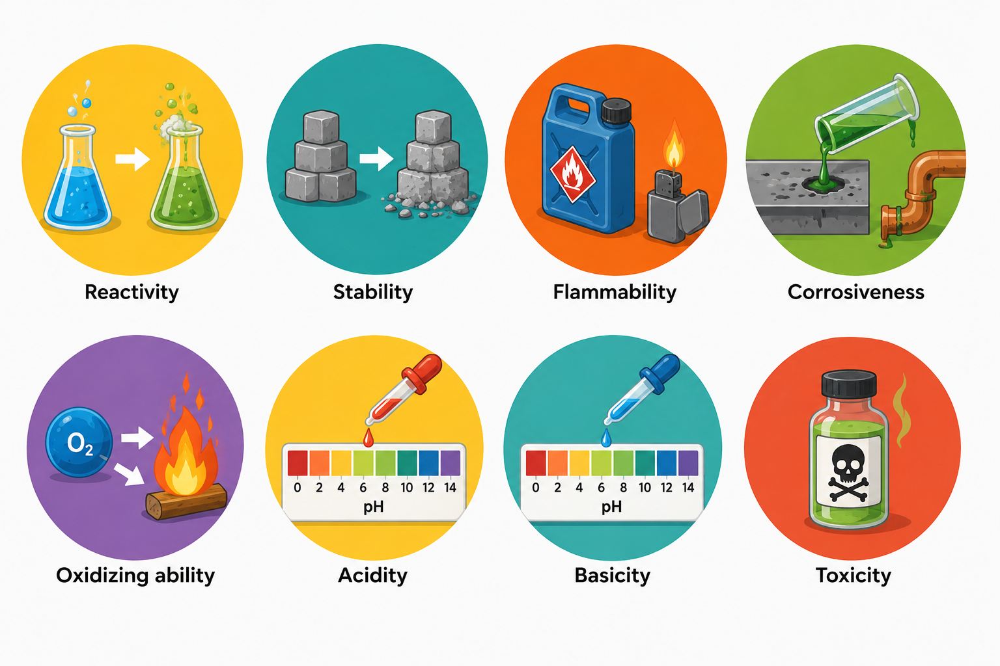

# 🧪 Lesson 13: Chemical Properties

## 🎯 Learning Objectives

By the end of this lesson, you will be able to:

- Understand the concept of chemical properties.
- Explain the meaning of chemical reactivity and chemical stability.
- Identify factors that affect chemical reactions.
- Recognize the importance of chemical properties in industrial processes.
- Apply technical vocabulary related to chemical properties and reactions.

---

# 📘 Main Content

## Introduction to Chemical Properties ⚗️

Chemical engineers work with substances that undergo chemical changes to produce valuable products. Unlike **physical properties**, which can be observed without changing a substance's identity, **chemical properties** describe how a substance behaves during a chemical reaction.

Chemical properties determine whether a substance reacts with other materials, how fast it reacts, and the products that are formed.

Understanding chemical properties is essential for:

- 🏭 Designing industrial processes
- ⚙️ Selecting construction materials
- 🔥 Preventing hazardous reactions
- ♻️ Improving process efficiency
- 🧪 Developing new products
- ⚠️ Maintaining workplace safety

💡 **Inferred explanation:** Knowledge of chemical properties allows engineers to predict how substances will behave under different operating conditions and to design safer, more efficient industrial processes.

---

# ⚛️ What Are Chemical Properties?

A **chemical property** is a characteristic that describes a substance's ability to undergo a chemical change and form new substances.

Unlike density or melting point, chemical properties can only be observed when a chemical reaction occurs.

Examples include:

Chemical engineers evaluate these properties before selecting materials or designing processes.

---

# 🔥 Reactivity

**Reactivity** describes how easily a substance undergoes a chemical reaction.

Some substances react very quickly, while others react slowly or remain nearly unchanged under normal conditions.

Highly reactive substances require careful handling because they may react with air, water, heat, or other chemicals.

---

## ⚙️ Factors Affecting Reactivity

Several factors influence how readily a chemical reacts.

### 🌡️ Temperature

Increasing temperature generally increases the rate of many chemical reactions because particles move faster and collide more frequently.

Example:

Many industrial reactors operate at elevated temperatures to increase production rates.

---

### 📈 Concentration

Higher concentrations usually increase the probability of particle collisions.

Example:

A concentrated acid often reacts more rapidly than a dilute acid.

---

### ⚡ Pressure

Pressure mainly affects reactions involving gases.

Increasing pressure brings gas molecules closer together, increasing the frequency of collisions.

Example:

High-pressure reactors are commonly used in ammonia production.

---

### 🧪 Catalysts

A **catalyst** increases the reaction rate without being consumed during the reaction.

Catalysts lower the activation energy required for a reaction.

Examples:

- Platinum in catalytic converters
- Iron catalysts in ammonia production
- Enzymes in biotechnology

Catalysts improve efficiency and reduce energy consumption in many industrial processes.

---

### 🧱 Surface Area

Increasing the surface area of a solid exposes more particles to reactants.

Example:

Powdered calcium carbonate reacts faster than a large solid block of the same material.

---

# ⚗️ Types of Chemical Reactions

Chemical engineers encounter many reaction types.

Common examples include:

### 🔥 Combustion

A substance reacts with oxygen, releasing heat and often light.

Example:

Methane burns in oxygen to produce carbon dioxide and water.

Applications:

- Boilers
- Furnaces
- Power plants

---

### 🔄 Oxidation and Reduction

**Oxidation** involves the loss of electrons, while **reduction** involves the gain of electrons.

These reactions are known collectively as **redox reactions**.

Applications:

- Corrosion control
- Battery technology
- Metal extraction
- Electrochemical processes

---

### ⚗️ Acid-Base Reactions

Acids react with bases to produce salts and water.

Example:

Hydrochloric acid reacts with sodium hydroxide to form sodium chloride and water.

Applications:

- Water treatment
- Chemical manufacturing
- Waste neutralization

---

### 🧬 Polymerization

Small molecules combine to form large molecules called polymers.

Applications:

- Plastic production
- Synthetic fibers
- Rubber manufacturing

---

# 🛡️ Chemical Stability

**Chemical stability** describes a substance's ability to resist chemical change under normal conditions.

Stable substances react slowly or not at all unless exposed to specific conditions.

Examples of stable substances include:

- Nitrogen gas at room temperature
- Noble gases
- Many ceramic materials

Highly stable materials are often selected for storage tanks, pipelines, and laboratory containers.

---

## ⚠️ Factors Affecting Stability

Several environmental conditions influence chemical stability.

### 🌡️ Temperature

High temperatures may cause substances to decompose or react.

Example:

Some pharmaceuticals lose stability when stored above recommended temperatures.

---

### 💧 Moisture

Certain chemicals react with water or absorb moisture from the air.

Example:

Quicklime reacts readily with water to produce calcium hydroxide.

---

### ☀️ Light

Some chemicals decompose when exposed to sunlight or ultraviolet radiation.

Example:

Hydrogen peroxide gradually decomposes in the presence of light.

---

### 🌬️ Oxygen

Exposure to oxygen may cause oxidation.

Examples:

- Rusting of iron
- Oxidation of edible oils
- Degradation of some chemicals

Proper storage minimizes these effects.

---

# ⚠️ Reactive and Stable Chemicals in Industry

Chemical engineers classify materials according to their behavior.

### Highly Reactive Chemicals

Examples:

- Sodium metal
- Chlorine gas
- Hydrogen peroxide (high concentration)
- Concentrated nitric acid

These substances require strict safety procedures.

---

### Stable Chemicals

Examples:

- Water
- Nitrogen
- Glass
- Stainless steel

Stable materials are commonly used in industrial equipment because they resist chemical change under normal operating conditions.

---

# 🏭 Industrial Applications

Understanding chemical properties is essential in many industries.

### 🛢️ Petroleum Industry

Engineers evaluate:

- Fuel stability
- Oxidation resistance
- Catalyst performance

---

### 💊 Pharmaceutical Industry

Engineers monitor:

- Drug stability
- Shelf life
- Decomposition reactions

---

### 🌱 Environmental Engineering

Engineers study:

- Pollutant degradation
- Water treatment reactions
- Chemical oxidation processes

---

### 🧴 Polymer Industry

Engineers optimize:

- Polymerization reactions
- Material stability
- Product durability

Knowledge of chemical properties supports efficient production and safe handling.

---

# 📄 Chemical Property Information in Engineering Documents

Chemical property data appear in many technical documents, including:

- 📘 Safety Data Sheets (SDS)
- 📋 Technical specifications
- 📊 Laboratory reports
- ⚙️ Operating procedures
- 📈 Research publications
- 🧪 Process design documents

These documents provide information about reactivity, stability, hazards, storage requirements, and recommended handling procedures.

---

# 🌍 Importance of Chemical Properties

Understanding chemical properties allows engineers to:

- Predict reaction behavior.
- Select compatible materials.
- Prevent dangerous reactions.
- Design efficient reactors.
- Improve product quality.
- Store chemicals safely.
- Protect workers and the environment.
- Comply with safety regulations.

Chemical properties are essential for both process design and industrial safety.

---

# 📖 Key Vocabulary

| Term | Definition |
|------|------------|
| Chemical Property | Characteristic describing how a substance behaves during a chemical reaction. |
| Reactivity | Tendency of a substance to undergo a chemical reaction. |
| Stability | Ability of a substance to resist chemical change. |
| Catalyst | Substance that increases the reaction rate without being consumed. |
| Oxidation | Chemical process involving the loss of electrons. |
| Reduction | Chemical process involving the gain of electrons. |
| Combustion | Reaction with oxygen that releases heat and often light. |
| Corrosion | Gradual deterioration of materials due to chemical reactions. |
| Polymerization | Chemical process in which small molecules form larger molecules. |
| Decomposition | Breakdown of a compound into simpler substances. |
| Flammability | Ability of a substance to catch fire. |
| Reactant | Substance that participates in a chemical reaction. |
| Product | Substance formed during a chemical reaction. |
| Shelf Life | Length of time a product remains suitable for use. |
| Hazard | Potential source of harm or danger. |

---

# ✏️ Exercise 1 — Match the Vocabulary 🧩

Match each term with its correct definition.

| Term | Definition |
|------|------------|
| 1. Reactivity | A. Ability to resist chemical change |
| 2. Stability | B. Substance that speeds up a reaction |
| 3. Catalyst | C. Tendency to undergo a chemical reaction |
| 4. Combustion | D. Reaction with oxygen that releases heat |
| 5. Corrosion | E. Deterioration caused by chemical reactions |

Show answers

1 → C

2 → A

3 → B

4 → D

5 → E

---

# ✏️ Exercise 2 — Fill in the Blanks 📝

**Word Bank**

- catalyst
- stability
- oxidation
- combustion
- decomposition
- reactivity

1. A __________ increases the rate of a chemical reaction without being consumed.

2. The ability of a substance to resist chemical change is called __________.

3. Rusting of iron is an example of __________.

4. __________ is a reaction with oxygen that releases heat.

5. Some substances undergo __________ when exposed to high temperatures.

6. The tendency of a substance to react with other materials is called __________.

Show answers

1. catalyst

2. stability

3. oxidation

4. combustion

5. decomposition

6. reactivity

---

# ✏️ Exercise 3 — Vocabulary in Context 🚀

Answer the following questions using complete sentences.

1. What is the difference between a physical property and a chemical property?

2. Name four factors that can affect the reactivity of a substance.

3. Why are catalysts important in industrial chemical processes?

4. How can temperature, moisture, and light affect the stability of chemicals?

5. Why is understanding chemical properties important for chemical engineers?

Show answers

1. A physical property can be measured without changing a substance's chemical identity, while a chemical property describes how a substance behaves during a chemical reaction.

2. Possible answers include temperature, concentration, pressure (for gases), catalysts, and surface area.

3. Catalysts increase reaction rates without being consumed, improving process efficiency and reducing energy consumption.

4. High temperatures may cause decomposition, moisture can trigger reactions with water-sensitive substances, and light can cause some chemicals to decompose or degrade.

5. Understanding chemical properties helps engineers predict reactions, select appropriate materials, design safe processes, improve product quality, and comply with safety regulations.

---

# ✅ Lesson Summary

In this lesson, you learned:

- 🧪 The meaning of chemical properties and how they differ from physical properties.
- 🔥 The concept of chemical reactivity and the factors that influence reaction rates.
- 🛡️ The importance of chemical stability and the environmental conditions that can affect it.
- ⚗️ Common reaction types, including combustion, oxidation-reduction, acid-base reactions, and polymerization.
- 🏭 Practical applications of chemical properties in petroleum refining, pharmaceuticals, environmental engineering, and polymer manufacturing.
- 📚 Essential technical vocabulary related to chemical properties and chemical reactions.

Understanding chemical properties is essential for chemical engineers because these properties determine how substances behave during industrial processes. Knowledge of reactivity and stability supports safe chemical handling, efficient process design, reliable product quality, and responsible environmental management.