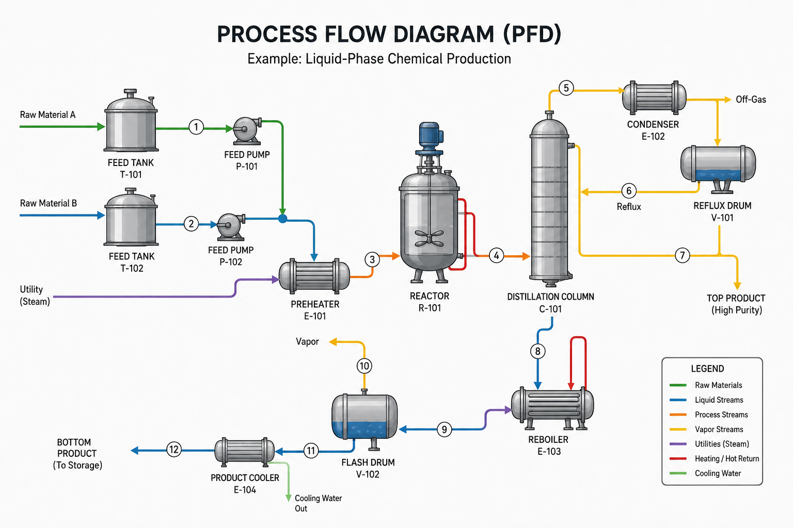
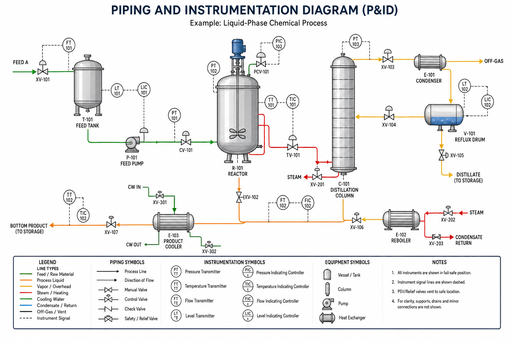

# 📐 Lesson 4: Technical Drawings

## 🎯 Learning Objectives

By the end of this lesson, you will be able to:

- Understand the purpose of technical drawings in chemical engineering.
- Identify the main components of a Process Flow Diagram (PFD).
- Recognize the basic elements of a Piping and Instrumentation Diagram (P&ID).
- Interpret common engineering symbols and abbreviations.
- Apply technical vocabulary related to process diagrams and engineering documentation.

---

# 📘 Main Content

## Introduction to Technical Drawings 🏗️

Technical drawings are standardized graphical representations used to communicate engineering information. They provide a visual description of industrial processes, equipment, piping systems, instrumentation, and control systems. Instead of using long written explanations, engineers rely on technical drawings to communicate complex information quickly and accurately.

In chemical engineering, technical drawings are essential during every stage of a project, from conceptual design and construction to plant operation, maintenance, troubleshooting, and future expansions.

A well-prepared technical drawing allows engineers, operators, contractors, and maintenance personnel to understand how a system works without ambiguity. Because engineering projects often involve international teams, standardized symbols and conventions make technical drawings understandable regardless of language.

💡 **Inferred explanation:** Technical drawings function as the universal language of engineering by presenting information visually through internationally recognized standards and symbols.

---

# 🏭 Why Technical Drawings Are Important

Technical drawings serve many important purposes in chemical engineering.

They help engineers to:

- 📋 Plan new industrial plants.
- ⚙️ Design manufacturing processes.
- 🔧 Install equipment correctly.
- 🛠️ Perform maintenance safely.
- 🔍 Troubleshoot operational problems.
- 📈 Improve production efficiency.
- ⚠️ Identify potential safety hazards.
- 🤝 Communicate with multidisciplinary engineering teams.
- 📚 Document modifications made to industrial facilities.

Without technical drawings, operating a chemical plant safely and efficiently would be extremely difficult.

---

# 🌊 Process Flow Diagrams (PFD)

A **Process Flow Diagram (PFD)** is one of the first drawings created during the design of a chemical plant. It provides a simplified overview of the manufacturing process by showing the major equipment, the flow of materials, and the main operating conditions.

A PFD does **not** include every pipe, valve, or instrument. Instead, it focuses on the overall process and how materials move through the system.

---

## 🎯 Purpose of a PFD

A Process Flow Diagram is used to:

- Show the overall production process.
- Illustrate the sequence of process operations.
- Display major process equipment.
- Indicate the direction of material flow.
- Present key operating data.
- Support process design and optimization.

PFDs are commonly used during feasibility studies, process design, training, and communication between engineering disciplines.

---

## ⚙️ Main Components of a PFD

A Process Flow Diagram normally includes the following elements:

### 🏭 Major Equipment

Only the principal equipment is shown.

Examples include:

- Reactor
- Heat exchanger
- Distillation column
- Pump
- Compressor
- Storage tank
- Separator
- Furnace
- Mixer

Each piece of equipment is represented by a standardized engineering symbol.

---

### ➡️ Process Streams

Process streams represent the movement of materials through the plant.

Each stream usually includes information such as:

- Stream number
- Flow direction
- Temperature
- Pressure
- Flow rate
- Composition

Arrows indicate the direction in which fluids move.

---

### 📊 Operating Conditions

Key process variables are often displayed beside equipment or process streams.

Examples include:

- Temperature (°C or K)
- Pressure (bar or Pa)
- Flow rate (kg/h, L/min, or m³/h)
- Composition (%)

These values help engineers understand how the process operates under normal conditions.

---

### 📝 Equipment Identification

Each major piece of equipment receives a unique identification number.

Examples:

- R-101 → Reactor
- P-201 → Pump
- T-301 → Storage Tank
- E-401 → Heat Exchanger

These identification numbers simplify communication throughout the project.

---

# 📖 Reading a Process Flow Diagram

When engineers analyze a PFD, they usually follow these steps:

1. Identify the raw material feed.
2. Follow the direction of the process streams.
3. Observe each major piece of equipment.
4. Note operating conditions.
5. Identify intermediate products.
6. Locate the final product stream.
7. Understand recycle or waste streams if present.

Reading a PFD systematically makes it easier to understand even complex industrial processes.

---

# 🔧 Piping and Instrumentation Diagrams (P&ID)

A **Piping and Instrumentation Diagram (P&ID)** provides much more detail than a Process Flow Diagram.

While a PFD focuses on the overall process, a P&ID shows exactly how the plant is constructed and controlled.

P&IDs are among the most important engineering documents used during construction, operation, maintenance, and troubleshooting.

---

## 🎯 Purpose of a P&ID

A P&ID is used to:

- Show all piping connections.
- Display valves and fittings.
- Identify measurement instruments.
- Illustrate process control systems.
- Document safety devices.
- Support plant maintenance.
- Guide equipment installation.
- Assist in troubleshooting.

Because of their level of detail, P&IDs are considered working documents throughout the life of a chemical plant.

---

## ⚙️ Main Components of a P&ID

A P&ID contains many more details than a PFD.

Typical elements include:

### 🛢️ Equipment

Major equipment appears similarly to the PFD but with additional information.

Examples:

- Reactors
- Pumps
- Compressors
- Heat exchangers
- Columns
- Storage vessels

---

### 🚰 Piping

Every process pipe is shown.

Information may include:

- Pipe size
- Material
- Flow direction
- Line number
- Insulation
- Pipe specification

---

### 🚪 Valves

Different valve symbols indicate different functions.

Examples:

- Gate valve
- Ball valve
- Globe valve
- Check valve
- Control valve
- Relief valve

Each valve serves a specific purpose within the process.

---

### 🎛️ Instrumentation

Instrumentation monitors and controls process variables.

Examples include:

- Temperature indicator (TI)
- Pressure indicator (PI)
- Flow indicator (FI)
- Level indicator (LI)
- Temperature transmitter (TT)
- Pressure transmitter (PT)
- Flow transmitter (FT)
- Level transmitter (LT)

These instruments send information to the plant control system.

---

### 🤖 Control Systems

Modern chemical plants use automatic control systems.

A P&ID illustrates how sensors, controllers, and valves interact.

Typical components include:

- Controllers
- Control loops
- Signal lines
- Alarms
- Interlocks
- Emergency shutdown systems (ESD)

Automation improves safety, efficiency, and product consistency.

---

# 🔤 Common Instrument Tags

Engineers use standardized letter codes to identify instruments.

| Tag | Meaning |
|------|---------|
| TI | Temperature Indicator |
| TT | Temperature Transmitter |
| PI | Pressure Indicator |
| PT | Pressure Transmitter |
| FI | Flow Indicator |
| FT | Flow Transmitter |
| LI | Level Indicator |
| LT | Level Transmitter |
| FC | Flow Controller |
| PC | Pressure Controller |
| TC | Temperature Controller |
| LC | Level Controller |

For example:

**FT-101**

- **F** = Flow
- **T** = Transmitter
- **101** = Instrument identification number

These tags allow engineers to locate and identify instruments quickly.

---

# 🔍 Comparing PFD and P&ID

| Feature | PFD | P&ID |
|---------|------|------|
| Level of Detail | General | Detailed |
| Equipment | Major equipment only | All equipment |
| Piping | Simplified | Complete piping |
| Valves | Usually omitted | Fully shown |
| Instruments | Very limited | All instruments |
| Control Loops | Usually omitted | Included |
| Operating Data | Included | Limited |
| Main Purpose | Process understanding | Plant construction and operation |

Although both diagrams describe the same process, they serve different purposes.

---

# 📄 Technical Drawings in Industry

Chemical engineers use technical drawings throughout a project's life cycle.

Examples include:

- 🏗️ Plant design
- ⚙️ Equipment installation
- 🔧 Maintenance planning
- 📋 Safety reviews
- 🛠️ Troubleshooting
- 📈 Process optimization
- 👷 Operator training
- 📚 Regulatory documentation

Accurate technical drawings reduce errors, improve communication, and increase plant reliability.

---

# 🌍 Why Engineers Must Understand PFDs and P&IDs

Reading engineering drawings is a fundamental skill for chemical engineers.

These documents help engineers:

- Understand process operation.
- Locate equipment and instruments.
- Diagnose production problems.
- Improve plant safety.
- Plan maintenance activities.
- Communicate with engineers from different disciplines.
- Support process improvements and future expansions.

Professionals who can interpret technical drawings accurately are better prepared to work in modern industrial facilities.

---

# 📖 Key Vocabulary

| Term | Definition |
|------|------------|
| Process Flow Diagram (PFD) | Simplified diagram showing the overall process and major equipment. |
| Piping and Instrumentation Diagram (P&ID) | Detailed diagram showing piping, equipment, instruments, and control systems. |
| Process Stream | Flow of material through a process. |
| Instrument | Device used to measure or control process variables. |
| Control Loop | System that automatically regulates a process variable. |
| Valve | Device used to control the flow of fluids. |
| Transmitter | Instrument that sends measurement signals to a control system. |
| Controller | Device that adjusts process conditions automatically. |
| Equipment Tag | Identification code assigned to equipment. |
| Flow Direction | Direction in which materials move through the process. |
| Line Number | Unique identifier assigned to a pipe. |
| Relief Valve | Safety device that releases excess pressure. |
| Operating Conditions | Process variables such as temperature and pressure. |
| Process Variable | A measurable property such as temperature, pressure, flow, or level. |
| Diagram | A graphical representation of a system or process. |

---

# ✏️ Exercise 1 — Match the Vocabulary 🧩

Match each term with its correct definition.

| Term | Definition |
|------|------------|
| 1. PFD | A. Measures process variables |
| 2. P&ID | B. Simplified process diagram |
| 3. Instrument | C. Detailed engineering drawing |
| 4. Valve | D. Controls fluid flow |
| 5. Process Stream | E. Movement of materials |

Show answers

1 → B

2 → C

3 → A

4 → D

5 → E

---

# ✏️ Exercise 2 — Fill in the Blanks 📝

**Word Bank**

- transmitter
- control loop
- PFD
- valve
- process stream
- pressure

1. A __________ provides a simplified overview of an industrial process.

2. A __________ controls the movement of fluids through a pipe.

3. The __________ shows the direction in which materials flow.

4. A __________ sends measurement signals to the control system.

5. A __________ automatically regulates a process variable.

6. Temperature and __________ are common operating conditions shown in engineering documents.

Show answers

1. PFD

2. valve

3. process stream

4. transmitter

5. control loop

6. pressure

---

# ✏️ Exercise 3 — Vocabulary in Context 🚀

Answer the following questions using complete sentences.

1. What is the main purpose of a Process Flow Diagram (PFD)?

2. How does a P&ID differ from a PFD?

3. Why are standardized instrument tags important in engineering?

4. Name five components commonly found in a P&ID.

5. Why are technical drawings essential during plant operation and maintenance?

Show answers

1. A PFD provides a simplified overview of a chemical process, showing the major equipment, process streams, and operating conditions.

2. A P&ID contains much more detail than a PFD, including piping, valves, instruments, control systems, and safety devices.

3. Standardized instrument tags help engineers quickly identify, locate, and communicate about specific instruments within a plant.

4. Possible answers include piping, valves, reactors, pumps, heat exchangers, storage tanks, transmitters, controllers, control loops, and safety devices.

5. Technical drawings help engineers operate equipment safely, perform maintenance, troubleshoot problems, communicate effectively, and document plant modifications.

---

# ✅ Lesson Summary

In this lesson, you learned:

- 📐 The purpose and importance of technical drawings in chemical engineering.
- 🌊 How Process Flow Diagrams (PFDs) provide a simplified view of industrial processes.
- 🔧 How Piping and Instrumentation Diagrams (P&IDs) present detailed information about piping, equipment, instruments, and control systems.
- 🔤 Common instrument tags and engineering symbols used in process documentation.
- 📚 Essential technical vocabulary for interpreting engineering drawings.

The ability to read and understand PFDs and P&IDs is a core skill for chemical engineers. These diagrams support plant design, safe operation, maintenance, troubleshooting, and effective communication across engineering teams.