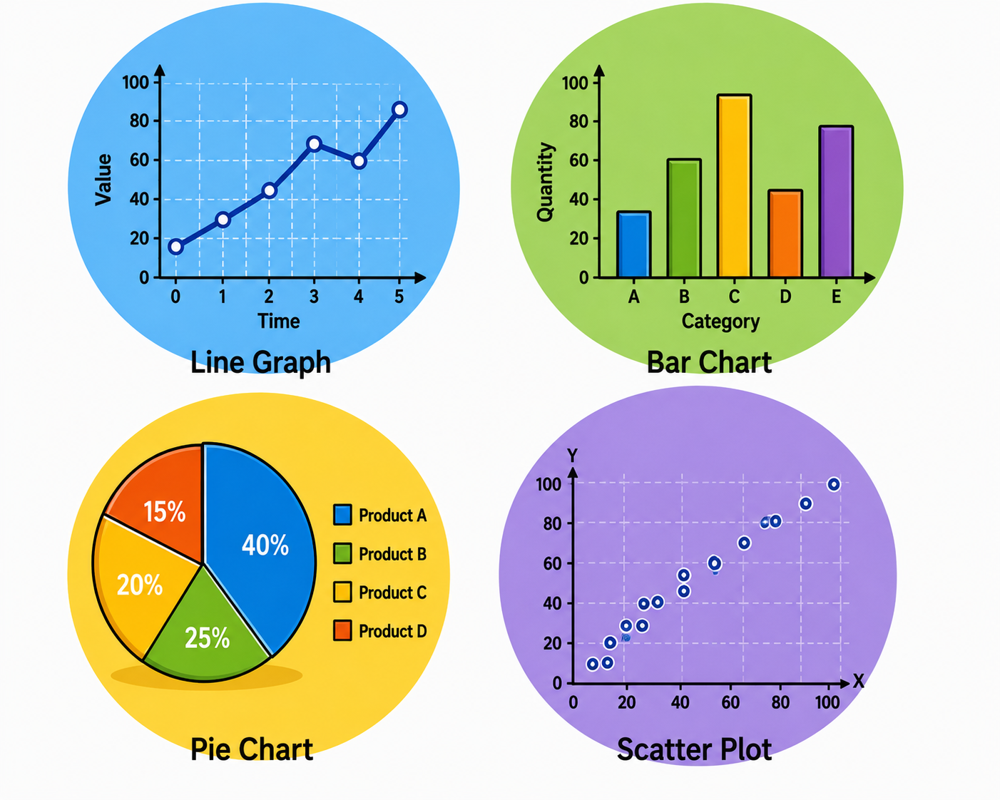

# 📊 Lesson 5: Data and Graphs

## 🎯 Learning Objectives

By the end of this lesson, you will be able to:

- Understand the importance of data presentation in chemical engineering.
- Read and interpret tables, charts, and graphs.
- Identify different types of graphs and their purposes.
- Describe trends using appropriate technical English.
- Apply vocabulary related to data analysis and graphical representation.

---

# 📘 Main Content

## Introduction to Data and Graphs 📈

Chemical engineers work with large amounts of data every day. During experiments, production, quality control, and plant operation, engineers collect information about temperature, pressure, flow rate, concentration, energy consumption, and product quality.

Raw data alone can be difficult to understand. Therefore, engineers organize information into **tables**, **charts**, and **graphs**. These visual tools make it easier to identify patterns, compare values, monitor performance, and make informed decisions.

Data presentation is essential for technical reports, laboratory experiments, engineering meetings, scientific publications, and process optimization.

💡 **Inferred explanation:** Presenting data visually helps engineers recognize relationships and trends that may not be obvious from numerical data alone.

---

# 📋 Tables

A **table** organizes information into rows and columns, making it easy to compare numerical values.

Tables are commonly used to present:

- 🌡️ Experimental results
- ⚙️ Equipment specifications
- 📊 Production data
- 🧪 Laboratory measurements
- 📈 Quality control results

### Example Table

| Time (min) | Temperature (°C) | Pressure (bar) |
|------------|------------------|----------------|
| 0 | 25 | 1.0 |
| 10 | 50 | 2.0 |
| 20 | 75 | 3.2 |
| 30 | 100 | 4.5 |

From this table, engineers can observe that both temperature and pressure increase over time.

Tables provide precise numerical information and are especially useful when exact values are important.

---

# 📊 Charts and Graphs

Charts and graphs convert numerical information into visual representations, making trends and comparisons easier to understand.

Different graph types are used depending on the type of data.

---

## 📈 Line Graph

A **line graph** shows how a variable changes over time or another continuous scale.

It is commonly used for:

- Temperature changes
- Pressure variation
- Production rate
- Energy consumption
- Flow rate

Example:

A line graph showing reactor temperature during a four-hour process can help engineers identify heating and cooling stages.

---

## 📉 Bar Chart

A **bar chart** compares values between different categories.

Examples include:

- Production from different plants
- Energy consumption by department
- Product quality comparison
- Material costs

Bar charts make it easy to compare quantities visually.

---

## 🥧 Pie Chart

A **pie chart** shows how different parts contribute to a whole.

Typical applications include:

- Raw material composition
- Product distribution
- Energy sources
- Production costs

Each slice represents a percentage of the total.

---

## 🔵 Scatter Plot

A **scatter plot** displays the relationship between two variables.

Chemical engineers use scatter plots to study relationships such as:

- Pressure versus temperature
- Flow rate versus production
- Concentration versus reaction rate
- Time versus product yield

Scatter plots help engineers determine whether variables are correlated.

---

# 📖 Reading Graphs

When interpreting a graph, engineers usually follow these steps:

1. Read the title.
2. Identify the x-axis.
3. Identify the y-axis.
4. Check the units.
5. Observe the overall trend.
6. Compare data points.
7. Draw conclusions.

Carefully reading axis labels and units prevents incorrect interpretations.

---

# 📏 Axes and Labels

Every graph contains two main axes.

### ↔️ X-axis

The horizontal axis usually represents:

- Time
- Distance
- Categories
- Sample number

### ↕️ Y-axis

The vertical axis usually represents:

- Temperature
- Pressure
- Flow rate
- Production
- Concentration
- Energy

Both axes should always include units of measurement.

Example:

- X-axis: Time (hours)
- Y-axis: Temperature (°C)

---

# 📈 Describing Trends

One of the most important skills in technical English is describing how data changes over time.

Engineers analyze trends to evaluate process performance and identify operational problems.

---

## ⬆️ Increasing Trends

Useful verbs include:

- Increase
- Rise
- Grow
- Climb
- Improve

Example:

*The reactor temperature increased steadily during the first hour.*

---

## ⬇️ Decreasing Trends

Useful verbs include:

- Decrease
- Fall
- Drop
- Decline
- Reduce

Example:

*The pressure gradually decreased after the valve was opened.*

---

## ➡️ Stable Trends

Useful expressions include:

- Remain constant
- Stay stable
- Remain unchanged
- Maintain the same level

Example:

*The flow rate remained constant throughout the experiment.*

---

## 🔄 Fluctuating Trends

Useful verbs include:

- Fluctuate
- Vary
- Oscillate

Example:

*The pressure fluctuated during startup before stabilizing.*

---

## 🚀 Rapid and Slow Changes

Engineers often describe the speed of change.

Examples:

Rapid change:

- Increase rapidly
- Rise sharply
- Drop suddenly

Slow change:

- Increase gradually
- Decline slowly
- Change slightly

Example:

*The concentration increased gradually as the reaction progressed.*

---

# 📝 Language for Comparing Data

Engineers frequently compare values using comparative expressions.

Examples include:

- Higher than
- Lower than
- Equal to
- Similar to
- Different from
- More efficient than
- Less expensive than

Example:

*Plant A produced more ethanol than Plant B.*

Example:

*The new process is more energy-efficient than the previous system.*

---

# 📊 Presenting Experimental Results

When writing reports, engineers describe both numerical values and observed trends.

Example:

> During the first 30 minutes, the reactor temperature increased from **25 °C** to **100 °C**, while the pressure rose from **1.0 bar** to **4.5 bar**. After reaching the target temperature, both variables remained stable for the remainder of the experiment.

This type of description combines numerical data with trend vocabulary.

---

# 📄 Where Engineers Use Data and Graphs

Data presentation is essential in many engineering activities.

Examples include:

- 🧪 Laboratory reports
- 📊 Process monitoring
- 📝 Technical reports
- 📈 Performance analysis
- ⚙️ Equipment testing
- 🔍 Quality control
- 🏭 Production management
- 🎤 Technical presentations
- 📚 Scientific publications

Engineers rely on accurate graphs and tables to communicate technical information effectively.

---

# 🌍 Importance of Data Interpretation

Being able to interpret data correctly allows engineers to:

- Detect equipment problems.
- Improve product quality.
- Increase production efficiency.
- Reduce operating costs.
- Optimize process conditions.
- Support engineering decisions.
- Improve plant safety.
- Communicate findings clearly.

Good data interpretation is one of the most valuable skills in engineering because many important decisions are based on measured data.

---

# 📖 Key Vocabulary

| Term | Definition |
|------|------------|
| Table | Information arranged in rows and columns. |
| Graph | Visual representation of numerical data. |
| Chart | Graphic display used to present information. |
| Line Graph | Graph showing changes over time. |
| Bar Chart | Graph used to compare categories. |
| Pie Chart | Graph showing proportions of a whole. |
| Scatter Plot | Graph showing the relationship between two variables. |
| Trend | General direction of change in data. |
| Increase | Become greater in value. |
| Decrease | Become smaller in value. |
| Fluctuate | Change irregularly over time. |
| Stable | Remaining constant without significant change. |
| Axis | Reference line used in graphs. |
| Data Point | Individual measured value shown on a graph. |
| Comparison | Examination of similarities and differences. |

---

# ✏️ Exercise 1 — Match the Vocabulary 🧩

Match each term with its correct definition.

| Term | Definition |
|------|------------|
| 1. Line Graph | A. Shows proportions of a whole |
| 2. Pie Chart | B. Information in rows and columns |
| 3. Table | C. Shows changes over time |
| 4. Scatter Plot | D. Relationship between two variables |
| 5. Trend | E. General direction of change |

Show answers

1 → C

2 → A

3 → B

4 → D

5 → E

---

# ✏️ Exercise 2 — Fill in the Blanks 📝

**Word Bank**

- increased
- stable
- bar chart
- fluctuated
- table
- scatter plot

1. A __________ is useful for comparing production values between different factories.

2. The reactor temperature __________ steadily during the heating stage.

3. Experimental results are often organized in a __________.

4. The pressure __________ during startup before becoming stable.

5. A __________ helps engineers study the relationship between pressure and temperature.

6. The flow rate remained __________ throughout the experiment.

Show answers

1. bar chart

2. increased

3. table

4. fluctuated

5. scatter plot

6. stable

---

# ✏️ Exercise 3 — Vocabulary in Context 🚀

Answer the following questions using complete sentences.

1. Why are tables useful in engineering reports?

2. What is the difference between a line graph and a bar chart?

3. Which type of graph would you use to show the relationship between temperature and pressure? Why?

4. Name three verbs that describe an increasing trend and three verbs that describe a decreasing trend.

5. Why is it important to include units on the axes of a graph?

Show answers

1. Tables organize numerical data clearly, making it easy to compare exact values and analyze experimental results.

2. A line graph shows how a variable changes over time, while a bar chart compares values between different categories.

3. A scatter plot is appropriate because it shows the relationship or correlation between two variables.

4. Increasing: increase, rise, grow. Decreasing: decrease, fall, decline. Other correct answers include climb, improve, drop, and reduce.

5. Units indicate what is being measured and ensure that the data is interpreted accurately.

---

# ✅ Lesson Summary

In this lesson, you learned:

- 📋 How tables organize engineering data.
- 📊 The purposes of line graphs, bar charts, pie charts, and scatter plots.
- 📈 How to describe increasing, decreasing, stable, and fluctuating trends.
- 📝 How engineers present and interpret experimental and production data.
- 📚 Essential vocabulary for discussing data analysis and graphical information.

Understanding data and graphs is a fundamental skill for chemical engineers. Accurate interpretation of tables and charts supports better decision-making, process optimization, quality control, and effective technical communication.