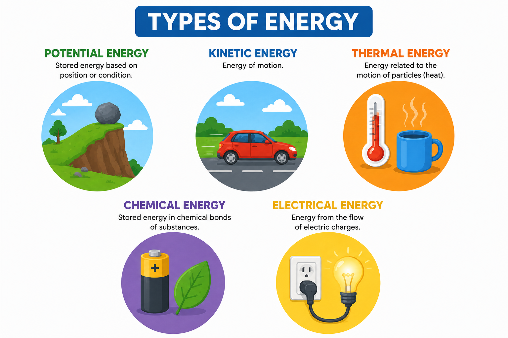
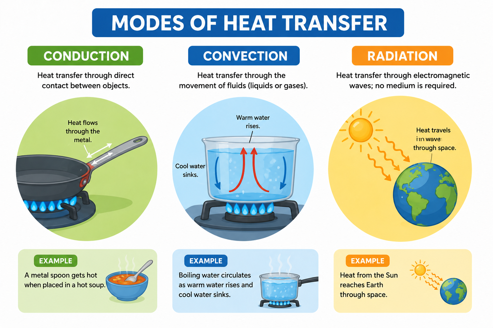

# 🔥 Lesson 9: Energy Balances

## 🎯 Learning Objectives

By the end of this lesson, you will be able to:

- Understand the concept of energy balances in chemical engineering.
- Explain the difference between heat and work.
- Identify the forms of energy in industrial processes.
- Apply the principle of conservation of energy.
- Use technical vocabulary related to energy balances, heat transfer, and work.

---

# 📘 Main Content

## Introduction to Energy Balances ⚡

Energy is essential in every chemical engineering process. Whether heating a reactor, cooling a product, pumping liquids, or operating industrial equipment, energy is continuously transferred, transformed, and utilized.

An **energy balance** is an engineering calculation used to account for all the energy entering, leaving, and accumulating within a system. Engineers use energy balances to design equipment, improve process efficiency, reduce energy consumption, and ensure safe plant operation.

Energy balances are applied in:

- 🏭 Chemical manufacturing
- ⚡ Power generation
- 🛢️ Oil and gas processing
- 🍎 Food production
- 💊 Pharmaceutical manufacturing
- 🌱 Renewable energy systems

💡 **Inferred explanation:** Energy balances help engineers understand how energy flows through a process so they can optimize performance and minimize waste.

---

# ⚖️ Law of Conservation of Energy

Energy balances are based on the **Law of Conservation of Energy**, also known as the **First Law of Thermodynamics**.

This law states that:

> **Energy cannot be created or destroyed; it can only be transferred or converted from one form to another.**

For example:

- Electrical energy can become heat.
- Chemical energy can become mechanical energy.
- Thermal energy can produce steam.
- Mechanical energy can generate electricity.

Although energy changes form, the total amount of energy remains constant.

---

# 🏭 What Is an Energy Balance?

An energy balance compares the energy entering and leaving a system.

The general equation is:

**Energy In + Energy Generated = Energy Out + Energy Stored**

In many engineering problems, energy generation inside the system is zero, making the equation simpler.

Energy balances help engineers calculate:

- Required heating
- Cooling demand
- Pumping power
- Equipment efficiency
- Fuel consumption
- Energy losses

---

# ⚡ Forms of Energy

Energy exists in many forms.

Chemical engineers commonly work with the following types.

## 🏔️ Potential Energy

Potential energy depends on the position or elevation of an object.

Examples:

- Water stored in elevated tanks
- Fluids moving through different heights
- Hydroelectric systems

In many chemical engineering calculations, changes in potential energy are relatively small and may be neglected.

## 🚀 Kinetic Energy

Kinetic energy is the energy of motion.

Examples:

- Flowing liquids
- Moving gases
- Rotating pumps
- Turbines

Higher flow velocity means greater kinetic energy.

## 🔥 Thermal Energy

Thermal energy is associated with the temperature of a substance.

Examples:

- Heating reactors
- Steam generation
- Cooling systems
- Heat exchangers

Thermal energy is transferred through heat.

## 🧪 Chemical Energy

Chemical energy is stored in chemical bonds.

Examples include:

- Fuels
- Natural gas
- Hydrogen
- Biomass
- Chemical reactions

Combustion releases chemical energy as heat.

## ⚡ Electrical Energy

Electrical energy powers industrial equipment such as:

- Electric motors
- Pumps
- Compressors
- Sensors
- Control systems
- Lighting

Electrical energy is often converted into mechanical or thermal energy.

---

# 🔥 Heat

**Heat** is the transfer of thermal energy caused by a temperature difference.

Heat always flows from a higher-temperature object to a lower-temperature object until thermal equilibrium is reached.

Heat is commonly represented by the symbol:

**Q**

Heat transfer occurs through three mechanisms.

---

## 🌡️ Conduction

Conduction is the transfer of heat through direct contact.

Example:

A metal pipe becomes hot because heat travels through its walls.

---

## 🌬️ Convection

Convection transfers heat through the movement of fluids.

Examples:

- Hot water circulating in a pipe
- Air flowing through a cooling system
- Cooling towers

---

## ☀️ Radiation

Radiation transfers heat through electromagnetic waves.

Examples:

- Solar heating
- Industrial furnaces
- High-temperature equipment

Radiation does not require direct contact or a fluid medium.

---

# ⚙️ Work

In engineering, **work** is the transfer of energy when a force moves an object or fluid.

Work is commonly represented by the symbol:

**W**

Examples include:

- Pumps moving liquids
- Compressors increasing gas pressure
- Turbines producing electricity
- Mixers stirring chemical solutions

Unlike heat, work is associated with mechanical or electrical actions rather than temperature differences.

---

# 🔄 Heat vs. Work

Although both heat and work transfer energy, they are different processes.

| Heat | Work |
|------|------|
| Caused by temperature difference | Caused by force or mechanical action |
| Symbol: Q | Symbol: W |
| Transfers thermal energy | Transfers mechanical or electrical energy |
| Occurs naturally from hot to cold | Requires applied force or energy input |

Understanding this difference is essential when performing energy balance calculations.

---

# 🌡️ Heat Transfer Equipment

Chemical engineers use specialized equipment to control heat transfer.

Common examples include:

### 🔥 Heat Exchanger

Transfers heat between two fluids without mixing them.

Applications:

- Process heating
- Process cooling
- Energy recovery

---

### 💨 Boiler

Produces steam by heating water.

Applications:

- Power generation
- Industrial heating
- Process steam production

---

### ❄️ Cooler

Removes heat from process fluids.

Applications:

- Product cooling
- Equipment protection
- Temperature control

---

### 🧊 Condenser

Converts vapor into liquid by removing heat.

Applications:

- Distillation
- Refrigeration
- Chemical processing

---

# 📊 Energy Balances in Industry

Energy balances help engineers evaluate:

- Fuel consumption
- Steam usage
- Electricity demand
- Heat recovery
- Process efficiency
- Equipment performance

They are used to reduce operating costs and improve sustainability.

For example, recovering waste heat from one process can reduce the energy required for another process.

---

# 🌱 Energy Efficiency

Energy efficiency measures how effectively energy is converted into useful work.

Improving efficiency provides many benefits:

- 💰 Lower operating costs
- 🌍 Reduced environmental impact
- ⚡ Lower energy consumption
- 🏭 Increased production efficiency
- ♻️ Reduced greenhouse gas emissions

Chemical engineers continuously seek opportunities to improve energy efficiency through better equipment, optimized operating conditions, and energy recovery systems.

---

# 📄 Energy Balances in Engineering Documents

Energy information appears in many engineering documents.

Examples include:

- 📘 Equipment manuals
- 📋 Energy balance reports
- 📊 Process Flow Diagrams (PFDs)
- 🔧 Heat exchanger specifications
- 📈 Process simulation reports
- 🧪 Laboratory reports
- ⚙️ Operating procedures

Engineers must understand these documents to operate industrial processes efficiently and safely.

---

# 🌍 Importance of Energy Balances

Energy balances help engineers:

- Optimize industrial processes.
- Reduce fuel consumption.
- Design heating and cooling systems.
- Improve equipment efficiency.
- Minimize energy losses.
- Support sustainable manufacturing.
- Ensure safe plant operation.

Energy balances are as important as material balances because every industrial process involves both mass and energy transfer.

---

# 📖 Key Vocabulary

| Term | Definition |
|------|------------|
| Energy Balance | Accounting of energy entering, leaving, and accumulating in a system. |
| Heat | Transfer of thermal energy due to a temperature difference. |
| Work | Transfer of energy by force or mechanical action. |
| Thermal Energy | Energy associated with temperature. |
| Chemical Energy | Energy stored in chemical bonds. |
| Kinetic Energy | Energy of motion. |
| Potential Energy | Energy due to position or elevation. |
| Heat Exchanger | Equipment that transfers heat between fluids. |
| Boiler | Equipment used to produce steam by heating water. |
| Condenser | Equipment that converts vapor into liquid. |
| Cooler | Equipment that removes heat from a process fluid. |
| Efficiency | Ability to convert energy into useful output with minimal losses. |
| First Law of Thermodynamics | Principle stating that energy cannot be created or destroyed. |
| Heat Transfer | Movement of thermal energy from one place to another. |
| Energy Recovery | Reuse of waste energy to improve process efficiency. |

---

# ✏️ Exercise 1 — Match the Vocabulary 🧩

Match each term with its correct definition.

| Term | Definition |
|------|------------|
| 1. Heat | A. Equipment that transfers heat between fluids |
| 2. Work | B. Energy of motion |
| 3. Heat Exchanger | C. Thermal energy transferred because of a temperature difference |
| 4. Kinetic Energy | D. Energy transferred by force or mechanical action |
| 5. Boiler | E. Equipment that produces steam |

Show answers

1 → C

2 → D

3 → A

4 → B

5 → E

---

# ✏️ Exercise 2 — Fill in the Blanks 📝

**Word Bank**

- heat
- work
- conduction
- efficiency
- boiler
- energy

1. The First Law of Thermodynamics states that __________ cannot be created or destroyed.

2. A __________ produces steam by heating water.

3. __________ is transferred because of a temperature difference.

4. __________ is transferred when a force moves an object or fluid.

5. __________ is the transfer of heat through direct contact.

6. Improving process __________ reduces energy consumption and operating costs.

Show answers

1. energy

2. boiler

3. heat

4. work

5. conduction

6. efficiency

---

# ✏️ Exercise 3 — Vocabulary in Context 🚀

Answer the following questions using complete sentences.

1. What does the First Law of Thermodynamics state?

2. What is the difference between heat and work?

3. Name three forms of energy commonly encountered in chemical engineering.

4. Why are heat exchangers important in industrial processes?

5. How do energy balances help chemical engineers improve industrial operations?

Show answers

1. The First Law of Thermodynamics states that energy cannot be created or destroyed; it can only be transferred or transformed from one form to another.

2. Heat is the transfer of thermal energy due to a temperature difference, while work is the transfer of energy through force or mechanical action.

3. Possible answers include thermal energy, chemical energy, kinetic energy, potential energy, and electrical energy.

4. Heat exchangers transfer heat between fluids without mixing them, improving energy efficiency and reducing operating costs.

5. Energy balances help engineers optimize processes, reduce fuel consumption, improve equipment performance, recover waste heat, increase efficiency, and support safe and sustainable plant operation.

---

# ✅ Lesson Summary

In this lesson, you learned:

- 🔥 The concept of energy balances and their role in chemical engineering.
- ⚖️ The First Law of Thermodynamics and the conservation of energy.
- ⚡ The main forms of energy encountered in industrial processes.
- 🌡️ The difference between heat and work and the mechanisms of heat transfer.
- 🏭 The purpose of heat transfer equipment such as heat exchangers, boilers, coolers, and condensers.
- 📚 Essential technical vocabulary related to energy balances and energy management.

Energy balances are fundamental tools in chemical engineering. Together with material balances, they allow engineers to design efficient processes, reduce energy consumption, improve sustainability, and ensure the safe and reliable operation of industrial plants.